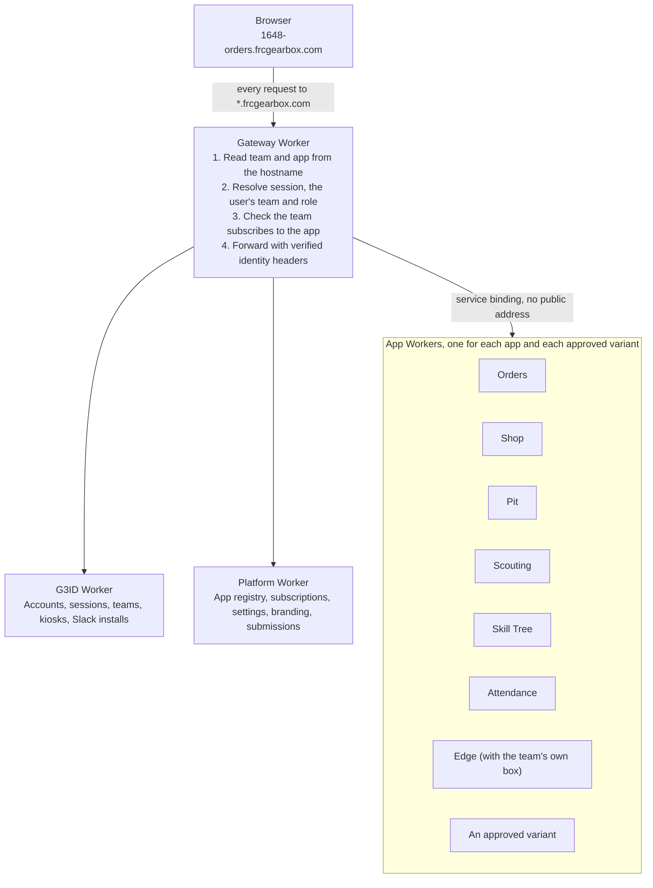

# Multi-Team Platform Roadmap

Status as of 10 October 2026. This file is the plan of record: when a change completes or advances a step, update the step's Status, the Progress table and "What landed" in the same pull request.

## Summary

Gearbox becomes one hosted platform at frcgearbox.com. Each team gets its own sign-in, branding and choice of apps, at addresses like `1648-orders.frcgearbox.com`, named by the team's FRC number.

The work runs in seven phases. G3 is the first team from the first migration, so `main` stays deployable for G3 at every step and there is no long-lived fork.

Labels on the arrows mark the three release points. Phases 5 and 6 each depend on Phase 4 but not on each other.

| Phase | What exists when it ends | Relative size |
| --- | --- | --- |
| 0. Groundwork | Tests, automated deploys, staging, one shared auth middleware, Attendance on D1 | Medium |
| 1. Remove G3 from the platform | G3 branding comes only from the team's config; internal code names stay | Medium |
| 2. Tenancy core | Teams, a team on every account, the gateway, a branded sign-in per team | Large |
| 3. Team-scoped apps | Every row and file belongs to a team; team settings are out of code | Largest |
| 4. App library and dashboard | Team admins turn apps on and off and edit settings | Medium |
| 5. Live demo | Anyone can try a seeded team with no account | Medium |
| 6. Creators' portal | Teams submit app variants; you review and publish them | Medium |

Sizes compare the phases to each other. They are not a schedule.

Three release points sit between phases: G3 moves to its frcgearbox.com addresses (done early, before Phase 3: its old g3robotics.com app addresses are retired), invited pilot teams join after Phase 4, and public sign-up opens after Phase 5.

## Progress

As of 10 October 2026, five of the six Phase 0 steps are done on `main`, Phase 1 is done (nothing a user sees says G3 unless it's G3's own settings), and Phase 2 is done: teams in G3ID, a team-aware gateway, sign-in, Slack and sign-up per team, and pages that take their team from their address. Phase 3 has started: its shared pieces (the platform SDK in `@g3/auth`, the tenancy lint and the isolation harness) are in, and Skill Tree, Pit, Attendance, Inventory (a ninth app, added built to that pattern), Orders, Shop and Edge (steps E.1 and E.2) are team-scoped, and Portal, which has no data of its own, shows only the team's own brand, each with a passing two-team isolation test. Scouting engagement controls provide early groundwork for optional plugins in Phase 4. Phase 4 has started: teams switch apps on and off on their home's `/admin` pages (offered each app's data as a download first, and every admin is told on Slack), the gateway keeps switched-off apps closed, the home lists only the apps that are on, every app's manifest lists its settings, plugins and hooks, the team's log records big settings changes in any app, and the home's admin pages have each app's settings in forms built from its manifest, the team's sign-in methods and its integrations. The rest of Phases 3 to 6 has not started. Edge is now planned as an app any team can run with its own box (see "Edge: an app any team can run"); its box link, the first step toward that, is done.

| Phase | Status | What is left |
| --- | --- | --- |
| 0. Groundwork | In progress | A staging environment (0.2) |
| 1. Remove G3 from the platform | Done | Nothing |
| 2. Tenancy core | Done | Nothing |
| 3. Team-scoped apps | In progress: the shared pieces, Skill Tree, Pit, Attendance, Inventory, Orders, Shop, Edge and Portal are done | Scouting |
| 4. App library and dashboard | In progress: the app library with full manifests (settings, plugins, seed, delete and export hooks), subscriptions, export before switching off, grace-period delete, Slack notes to admins, the gateway's check, Portal from subscriptions, the team's log of big settings changes, and the dashboard's Apps, App settings, Appearance, Sign-in and Integrations pages (Slack is connected on Integrations) | Scouting's settings and plugins on the dashboard (with its Phase 3 step), and the "Done when" check on staging (needs 0.2). Members, roles, kiosks and Attendance's own page stay on G3ID (decided 8 October) |
| 5. Live demo | Not started | All of it |
| 6. Creators' portal | Not started | All of it |

### What landed

| Change | Roadmap step | Pull request |
| --- | --- | --- |
| Inventory, a new app: what a team owns, where it's kept (a tree of locations) and what's in use on a robot, with check out and check in, vendor listings tied to Orders' catalog, merge and split, and a history per entry. Its fields, locations, robots and subsystems are a team's own: made on Settings or loaded from a setup file, with none in code or migrations. Orders can put received parts into it, required or not by a team setting | Built to the Phase 3 pattern from the start: tenancy sheet settled, settings out of code, a starter file in place of the seed hook (4.3) | [#154](https://github.com/midtownrobotics/Gearbox/pull/154) |
| App library: a manifest per app, which apps each team has on (`team_apps` on the platform), seed hooks on switching on, 90 days' grace then delete on switching off (a daily cron), the gateway's "not enabled", Portal from subscriptions, and the team's admin pages on its home (Apps, Appearance and Slack, the last two moved from G3ID). Teams already here keep every app; new teams start with none | 4.1 to 4.4 (no export), 4.6, 4.7, part of 4.5 | [#163](https://github.com/midtownrobotics/Gearbox/pull/163) |
| The team dashboard's App settings, Sign-in and Integrations pages: each app with settings answers `GET`/`PUT /api/team-settings` (`teamSettingsRoutes` in `@g3/auth`: values by manifest key, checked by type, editors from the manifest, logged), and the dashboard builds a form for each from its manifest. Integration keys stay on the app's own page; the Integrations page shows whether Slack, the edge box, Onshape and Share-A-Cart are connected and where to set each up. Admins choose which sign-in methods (Google, GitHub, Steam, kiosk PINs) the team allows; Slack is always on | 4.5 | This PR |
| Manifests in full: each app's settings (type, default, who edits it and where), optional plugins (Scouting's engagement modules) and an export hook. Each app with team data answers `GET /api/internal/teams/:id/export` (secrets left out), and the Apps page offers it as a download before switching an app off. Every admin gets a Slack DM when an app goes on or off. The team's log now records big settings changes in any app (Team Appearance, Slack, and each app's team settings: which fields, never values), sent through G3ID | 4.1, 4.4, part of 4.5 | This PR |
| Workers test setup and baseline tests for every worker | 0.1 | [#128](https://github.com/midtownrobotics/Gearbox/pull/128) |
| One auth middleware in `packages/auth` | 0.3 | [#128](https://github.com/midtownrobotics/Gearbox/pull/128) |
| One site config for domain, team and branding, with `pnpm configure` writing the generated values | 0.4, 1.5, most of 1.1, part of 1.4 | [#128](https://github.com/midtownrobotics/Gearbox/pull/128) |
| Attendance on D1, with production history copied and verified | 0.5 | [#133](https://github.com/midtownrobotics/Gearbox/pull/133) |
| MIT license, and draft terms and privacy policy in `docs/legal/` | Part of 0.6 | [#132](https://github.com/midtownrobotics/Gearbox/pull/132) |
| Each app's Worker serves its page and `/api`, behind one gateway on `*.g3robotics.com`; Pages retired | Most of 2.4, the start of 2.3 | [#138](https://github.com/midtownrobotics/Gearbox/pull/138), [#140](https://github.com/midtownrobotics/Gearbox/pull/140) |
| `apps/admin` and `workers/api` stubs removed | Rest of 0.6 | [#142](https://github.com/midtownrobotics/Gearbox/pull/142) |
| Teams in G3ID: a team on every account, kiosk, PIN and Slack code, and PINs unique within a team | 2.1, 2.2 | [#142](https://github.com/midtownrobotics/Gearbox/pull/142) |
| Team-aware gateway: team-number addresses, sessions and Origins kept to their team, identity headers; pages call other apps' APIs at a relative `/api/~<app>` | 2.3, most of 2.4 | [#142](https://github.com/midtownrobotics/Gearbox/pull/142) |
| Sign-in per team on `<number>-id`, with provider callbacks on `id.<domain>` and the team in the sign-in's state | 2.5 | [#142](https://github.com/midtownrobotics/Gearbox/pull/142) |
| Slack per team: workspaces connected from G3ID's admin page, tokens encrypted, commands and events routed by workspace | 2.6 | [#142](https://github.com/midtownrobotics/Gearbox/pull/142) |
| Team sign-up on the platform Worker: details, Slack, and the founder's code; the team registry; other teams' addresses on frcgearbox.com | 2.7 | [#142](https://github.com/midtownrobotics/Gearbox/pull/142) |
| Old `api.<app>` addresses retired (410 with the new address); Onshape webhook re-registers on save; time zone dropped from sign-up | Rest of 2.4, 2.7 | This PR |
| Local development through the gateway: every team's addresses on `*.gearbox.localhost:8796`, with links and sign-in kept local | 2.9 | This PR |
| Team context per page: names and links from the team's appearance settings, addresses from the page's team, no `%SITE_*%` placeholders | 2.10 | This PR |
| G3 removed from what users see: sign-in pages, messages, Scouting's logo, share image and colors, tab icons; README rewritten | 1.1, 1.3, 1.4, 1.6, 1.7 | This PR |
| G3 moved to its frcgearbox.com addresses (`1648-<app>.frcgearbox.com`); its g3robotics.com app, sign-in and console addresses retired (410) | G3's cutover, early | This PR |
| Operators' console on the platform Worker at `admin.<domain>`: an operator flag kept by the platform, teams and number reports, and tools to hand over, suspend or delete a team, with a 12-month access log (renumbering, also built then, was removed in Phase 3) | 2.8 | This pull request |
| A version per app, changelogs, and a `main` to `public` release flow | Part of 0.2 | [#128](https://github.com/midtownrobotics/Gearbox/pull/128), [#129](https://github.com/midtownrobotics/Gearbox/pull/129) |
| Shared navbar, light and dark mode, one color scheme | Groundwork for 1.3 | [#126](https://github.com/midtownrobotics/Gearbox/pull/126), [#127](https://github.com/midtownrobotics/Gearbox/pull/127) |
| Phase 3's shared pieces in `@g3/auth`: the request's team, team-scoped query helpers and members with roles; the tenancy lint in CI and the two-team isolation harness. Skill Tree is the first team-scoped app: a team on its tree set, students from the member list, and its isolation test | Phase 3: shared pieces, Skill Tree | This PR |
| Pit team-scoped: `team_id` on its tables, settings keyed by team, the team number from the team, the platform's Blue Alliance and Nexus keys for every team, and an isolation test | Phase 3: Pit | This PR |
| Deleting a team (operators' console) deletes its data in every team-scoped app first (each app's `DELETE /api/internal/teams/:id`, over service bindings; nothing else is deleted if one fails), then in G3ID; Shop also deletes its R2 files and Onshape webhook, Edge its box key and link. Orders' Share-A-Cart tokens are encrypted. Team renumbering removed from the console (and the terms draft) | Fixes 2.8 for Phase 3 | This PR |
| Portal: G3's bundled logo removed; the public-site tile shows the team's logo from Team Appearance, or a globe | Phase 3: Portal | This PR |
| Edge team-scoped, one box per team (E.1, E.2): `team_id` on its 11 tables and a new `edge_boxes`, each box's own key (made by admins on the Edge Box page, stored hashed), a link per team, a nightly rollup per team, days in the box's own time zone, Orders' lookups and Shop's printing on the member's own team's box, and an isolation test | Phase 3: Edge (E.1, E.2) | This PR |
| Shop team-scoped: `team_id` on its 15 tables, its R2 files under `teams/<team>/` (G3's copied once by a script), each team's own Onshape keys and webhook (encrypted, the team found by the address an event comes in on), release and summary posts on the team's own Slack through G3ID (`sendTeamMessage`), and an isolation test over D1 and R2 | Phase 3: Shop | This PR |
| Orders team-scoped: `team_id` on 16 of its 17 tables (the lookup cache stays shared), keys unique within a team, every query kept to the team; each team's own copy of the starter parts catalog; the team's currency and fiscal-year start as settings, with dates in each viewer's local time (no team time zone); Share-A-Cart connected per team; approval DMs on the team's own Slack through G3ID (`sendTeamDM`); part lookup refused, not broken, for teams without an edge box; an isolation test | Phase 3: Orders | This PR |
| Inventory team-scoped: `team_id` on its nine tables, every query (its stock SQL included, moved to Drizzle) kept to the team, deliveries from Orders in the member's own team, and an isolation test | Phase 3: Inventory | This PR |
| Attendance team-scoped: Drizzle with the team helpers, `team_id` on its tables, the team's members for the leaderboard, per-team school year and auto sign-out settings (edited on G3ID's Attendance admin page), and an isolation test. Its kiosk and confirm pages use the shared colors and fonts | Phase 3: Attendance | This PR |
| G3ID's admin routes, member lists and name lookups kept to the caller's team (another team's admin could list, promote or delete any account and revoke any kiosk); a member can only unlink their own sign-ins; G3ID's own two-team admin isolation test | Fixes 2.2 and 2.5; groundwork for Phase 3's isolation tests | [#155](https://github.com/midtownrobotics/Gearbox/pull/155) |
| Slack sign-in and link codes unique within a team, not across the table, with expired codes cleared and a taken code drawn again (they had begun to collide, failing sign-ins) | Fixes 2.6 | [#153](https://github.com/midtownrobotics/Gearbox/pull/153) |
| Edge box reached over its own WebSocket (a Durable Object) instead of a Cloudflare Tunnel; live online clients and box addresses | Edge E.0: the box link that lets any team's box connect without a tunnel | [#151](https://github.com/midtownrobotics/Gearbox/pull/151) |
| Optional Scouting engagement with configurable points label, predictions, combined picks and standings; neutral prediction language | Part of 1.6; groundwork for 4.1 and 4.5 | [#143](https://github.com/midtownrobotics/Gearbox/pull/143) |
| Editable team appearance, reset to defaults, and editable/hidden portal resource links | Part of 1.3 and 1.4 | [#134](https://github.com/midtownrobotics/Gearbox/pull/134) |
| Skill Tree rebuilt on the shared app pattern: a React frontend in place of the Firebase-shaped shim, the shared navbar, palette, fonts and dark mode, and mentors taken from G3ID roles. Its trees are now a team's own content: a tree set that is loaded from a file (the default set on first use) and edited in the app. Its student list is G3ID's accounts. Earlier progress was cleared | Phase 3 for Skill Tree: tenancy sheet, settings out of code, frontend rewrite, and a stand-in for its seed hook (4.3). Part of 1.3 | [#144](https://github.com/midtownrobotics/Gearbox/pull/144) |

### What this changed in the plan

- **Internal names stay.** The team decided that `@g3/*` packages, the `G3ID` binding, and cookie and database names are not branding, and none of them are renamed in this roadmap. Step 1.1 covers only what users see, and the cookie rename (1.2) is dropped: in step 2.5 the `g3_session` cookie keeps its name and only moves to the frcgearbox.com domain.
- **One team per account.** A user belongs to exactly one team, held as `team_id` on the user row. There is no memberships table, and `is_admin`, `is_mentor` and `status` stay on the user as they are today (steps 2.1, 2.2).
- **The site config is the bridge to team records.** It is compiled into each app today, so one build serves one team. Step 2.10 replaces it with team context resolved on each request.
- **Releases shape deploys.** `main` deploys to staging and `public` to production (0.2). An approved variant goes live with the next release (Phase 6).
- **Operator tools live in the platform, not G3ID.** The operator flag, the console's API and its log are the platform Worker's, with the console in the platform app at `admin.<domain>` (step 2.8). G3ID only carries out what touches its accounts, through internal routes.
- **Changesets apply to everyone.** A variant's pull request needs one, like any other change to an app (6.4).
- **One app-level role list is gone before Phase 2.** Skill Tree kept its own list of mentors. It now uses the mentor and admin roles from sign-in, so step 2.2 has one less place to map roles from. Scouting's strategy admins are the list still left.
- **A ninth app, Inventory.** It wasn't in the plan. It's a core app like Orders, built the way Phase 3 leaves an app: every table is one team's data with no key that is unique across teams, and nothing about a team is in code. It adds one production database and one Worker, which the plan's limits have room for. Orders reaches it over a service binding as an optional neighbor, the same rule as for Edge: Orders works without it.
- **App content is loaded, not migrated.** Skill Tree's default trees are a file that goes through the same loader as a team's own file, the first time the app is opened. No migration holds content. That first-use load is what the seed hook (4.3) replaces, and it is the pattern for the other apps' starter data.
- **Edge is for every team, not only G3.** Edge was planned as G3's single-team app because each box needed a Cloudflare Tunnel set up by hand on G3's account. The box now opens its own WebSocket to the edge Worker, so another team's box needs only an address and a key, and nothing on Cloudflare per team. Edge becomes an optional app any team can subscribe to and pair its own box with. Its plan is the section "Edge: an app any team can run", which replaces "Edge: G3's single-team app"; Phase 3's Edge row, the Durable Object decision and the privacy notes change with it.
- **The SDK doesn't take the user from headers alone.** The plan said the SDK reads the gateway's identity headers. It reads the team from `X-Team-Id`, but still confirms who is signed in with G3ID (as `@g3/auth` already did), and counts a session only on its own team's addresses. Trusting `X-User-Id` alone would save one call per request, but then a worker reachable without the gateway (a `workers.dev` address left on by mistake) would let anyone claim to be anyone. The plan also had the SDK as its own package, `packages/platform`; it went into `@g3/auth` instead, since every worker already imports that for sign-in, and G3ID and the Platform worker stay separate services.
- **Each team gets its own copy of the parts catalog.** The plan had Orders' seeded catalog as shared reference data, with a team's edit making a copy for that team. Orders instead keeps the FRCDesign parts once as a starter and copies them to a team the first time it opens Orders: every catalog query is then an ordinary team query (the lint and isolation test check it like any other table), where shared rows would have needed copy-on-write in every catalog read, edit, category move and delete. The copy is about 2 MB per team in D1, about 400 MB for 200 teams, well inside the 10 GB a database can hold. The decision's effect is the same: a team's edits and prices stay with it. What it costs: a later fix to the starter (a script-generated relink like migration `0012`) has to update each team's copy too, and should only touch parts still as the starter had them, as `0015` does.
- **Apps send Slack messages through G3ID.** The decision was that apps ask G3ID for a team's Slack installation. They ask G3ID to send the message instead (`sendTeamDM` and `sendTeamMessage` in `@g3/auth`, G3ID's `/internal/teams/:id/slack/dm` and `/slack/message`), so a team's bot token never leaves G3ID. Orders and Shop use them; Scouting will.
- **Per-team secrets live in each app's own database.** The plan had them in the platform database. Shop keeps a team's Onshape keys in its own team-keyed settings, encrypted with its own `SECRETS_KEY` (the helper, `encryptSecret`, moved from G3ID into `@g3/auth`), following the 6 October decision that each app keeps its team settings in its own D1. Slack tokens stay in G3ID.
- **The app library is code, not a table.** The plan had an `apps` table filled from the manifests at deploy. The platform Worker imports every app's manifest instead (`src/registry.ts`), so the library is whatever was deployed, with nothing to keep in step. A table can come back with Phase 6's variants if they need one.
- **Settings and secrets stay in the apps.** Step 4.2's `team_settings` and `team_integrations` aren't built: following the 6 October decision, each app keeps its team's settings in its own D1 (secrets encrypted with its own `SECRETS_KEY`). The platform keeps only the registry, subscriptions and the team's log. Per-app settings forms (4.5) will read and write them through each app.
- **The dashboard is Portal's `/admin`.** The team's home is Portal, so its admin pages are Portal pages too, calling the platform's API through the gateway's `/api/~platform` and G3ID's through `/api/~id`. A separate dashboard app on the same host would have clashed with Portal's assets and dev server.
- **Teams already on the platform keep every app.** Before the library every team had every app, so migration `0005` switches all of them on for existing teams; a team that signs up after it starts with none. Scouting is only offered to the site's team until its data is kept per team (Phase 3).
- **A feature that needs another app is left out while that app is off.** The gateway closes a switched-off app to people, and pages leave out what depends on one (`useAppOn` and `appOn` in `@g3/ui`): Orders' part lookup and Shop's printing without Edge, Orders' receiving into Inventory without Inventory, Inventory's catalog, Request buttons and request links without Orders, and G3ID's Leaderboard and Attendance settings without Attendance. A setting about another app says so in its manifest (`requiresApp`) and leaves the App settings form with it. Workers can ask too (`teamHasApp` in `@g3/auth`, through G3ID): Orders never requires an Inventory place while Inventory is off. One app can still reach another over a service binding; the pages just stop asking.
- **Apps need the team's members with their roles.** Skill Tree's students are G3ID's accounts that aren't mentors, but G3ID's list of accounts carries no roles, so Skill Tree works out who the mentors are from sign-ins. The member list that apps read should include each member's role. This is added to the platform SDK's list in Phase 3. Done in Phase 3: `@g3/auth`'s `teamMembers` reads G3ID's member list with roles, and Skill Tree's `mentors` table is gone.

## Where the codebase started

This is the baseline from 3 October 2026, before any roadmap work. The Progress section shows what has changed since. Every layer assumed one team: one domain, one Slack workspace, one user list, and about 90 tables with no team column.

| Area | What is single-team today | Where |
| --- | --- | --- |
| Domain | `g3robotics.com` is hardcoded in 67 files (143 lines): CORS allowlists, the redirect check, the cookie domain, `.env.production`, Wrangler routes | every worker's `src/index.ts`; `workers/g3id/src/lib/redirect.ts` and `cookie.ts` |
| Users and roles | One global user list. `is_admin` and `is_mentor` are columns on the user. Emails are unique globally. PINs are 3 digits and unique globally, so 1,000 at most | `workers/g3id/src/db/schema.ts` |
| Sessions | Cookie `g3_session` on the parent domain. KV maps a session to a user ID and nothing else | `packages/auth`, `workers/g3id/src/lib/session.ts` |
| Auth in app workers | Seven workers each carry their own copy of the "ask G3ID who this is" middleware | `workers/*/src/middleware/auth.ts` |
| Slack | One workspace ID and one bot token in env. Sign-up is Slack-only | `workers/g3id/wrangler.toml`, `lib/slack-code.ts` |
| Data | Seven D1 databases, one per worker. Attendance keeps its data in a Firebase project (`g3-attendance`) instead | migrations; `workers/attendance/src/firestore.ts` |
| Hardware | One edge box: singleton rows (`CHECK (id = 1)`), one agent URL, one shared key | `workers/edge` |
| Deploys | Workers by hand with `wrangler deploy`. Frontends through Cloudflare Pages, one project per app. CI only lints, type-checks and tests | `.github/workflows/ci.yml` |
| Tests | Only `devices/edge-agent` has tests (10 files). No worker has any |  |

### Team settings that live in code or config

These are the items to pull out into per-team data.

| App | Setting | Where it lives now |
| --- | --- | --- |
| Pit | Team number, event key | `TEAM_NUMBER` and `EVENT_KEY` vars in `wrangler.toml` |
| Scouting | "Our team" is `frc1648` in match logic; `relationTo1648` in the API; "BoyleBucks" game name; strategy admins by email | `workers/scouting/src/index.ts`, `apps/scouting/src` |
| Portal | The app list, public site, Slack, TBA, Statbotics, GitHub and Instagram links | `apps/portal/src/plugins/home/home-page.tsx` |
| Skill Tree | All tree content, 60 KB of it | `apps/skill-tree/data/trees.js` |
| Shop | Two Slack channel IDs seeded by migrations; Onshape company ID and API keys in env; R2 bucket `g3-bucket` | migrations `0008`, `0015`; `wrangler.toml` |
| Orders | Fiscal year start (July) in code; Share-A-Cart account; Slack bot token | `src/lib/fiscal.ts`, env |
| Edge | 50 GB cap seeded by migration; agent URL and key in env | migration `0001`, `wrangler.toml` |
| All | Logo `g3.png`, burgundy palette, Agency FB font, "G3" in every title and nav bar | `packages/ui/src`, each app's `index.html` and `nav-bar.tsx` |

### What is already in good shape

- Most of what you named as team data is already rows that mentors edit in the UI: Orders budget categories, yearly budgets, vendors, naming template and keyword rules; Shop processes and subsystems; Pit checklists; Scouting forms. These need a team column, not a redesign.
- Six of nine apps share the plugin layout, every worker is Hono, and six of the eight use Drizzle on D1. One pattern covers most of them.
- Workers already reach G3ID through a service binding, so there is one place to add team context.

### What will cost the most

- Scouting is one 3,255-line worker file and a 2,118-line `App.tsx`, with 31 tables.
- Skill Tree is plain JavaScript written against a Firebase-shaped shim.

## Target architecture

One gateway Worker answers every `*.frcgearbox.com` request. It reads the team and app from the hostname, checks the session and the team's subscription, and hands the request to that app's Worker.

App Workers have no public address, so the gateway is the only way in. It asks the G3ID and Platform Workers who the user is and what the team has switched on.

### Addresses

| Address | What it serves |
| --- | --- |
| `frcgearbox.com` | Public site, team sign-up, "Try the demo" |
| `<number>.frcgearbox.com` | Team home (app launcher) and the team admin dashboard |
| `<number>-id.frcgearbox.com` | The team's sign-in page (G3ID) |
| `<number>-<app>.frcgearbox.com` | One app for one team. Pages and `/api` share the origin, so CORS is no longer needed |
| `id.frcgearbox.com` | OAuth callbacks (and Slack endpoints, 2.6). One fixed host, because providers need a registered callback address; the team travels in the sign-in's state |
| `creators.frcgearbox.com` | Creators' portal |
| `admin.frcgearbox.com` | Your team's console: review queue, teams, app library. Served by the platform Worker; until G3's cutover also at `admin.g3robotics.com`, where G3's operators' session cookie is |

A team's address is its FRC team number, and no two teams can share a number. The first hyphen always separates team from app: `1648-skill-tree` is team 1648, app `skill-tree`. A hostname that starts with a digit is a team; platform addresses (`www`, `id`, `creators`, `admin`, `demo`) are words, so teams need no slugs and no reserved list. In G3ID a team's id is its key, `frc<number>`.

### Identity

- **Each account belongs to one team.** The user row carries `team_id`, and roles stay where they are: `is_admin`, `is_mentor` and `status` (pending, active, rejected) on the user. A team's owner is recorded when team sign-up (2.7) is built. There is no memberships table. Emails and linked sign-ins stay unique across the platform, so someone who helps two teams needs a second account with a different email and sign-in.
- **Each team owns its sign-in environment:** which sign-in methods are allowed, how people join (invite link, its Slack workspace, admin approval), its Slack connection, its kiosks and PINs.
- **Platform operators are separate.** A flag the platform Worker keeps on G3ID accounts (its `operators` table), which no team role implies.
- **App code never sees the session cookie.** The gateway reads it, removes it, and passes verified identity (user, team, role, session type) to the app Worker over a service binding. App Workers have no public address of their own.
- **Kiosk PIN sessions belong to one team** and are refused on any other team's hosts.

### Data

- **One shared database per app, with a `team_id` on every team-owned row.** This keeps D1 and the current migrations. Queries go through a shared helper that cannot run without a team.
- **Three kinds of table,** decided per app: team data (has `team_id`), shared reference data that every team reads (TBA caches, the part-lookup cache, the base parts catalog), and platform data (teams, apps, subscriptions, submissions).
- **Files, keys and jobs carry the team:** R2 objects under `teams/<team_id>/`, KV keys prefixed, queue messages tagged, cron jobs looping over teams.
- **Per-team secrets** (Slack bot token, Onshape keys, Share-A-Cart tokens) are stored encrypted in the database of the app that uses them (Slack's in G3ID), with the key held as that Worker's secret (`encryptSecret` in `@g3/auth`). Done for Slack, Shop's Onshape keys and Orders' Share-A-Cart tokens.

### App library

- **An app is one Worker plus a manifest.** The Worker serves the built frontend and the API. The manifest declares slug, name, icon, roles, integrations it needs, a settings schema with defaults, and hooks to seed, export and delete a team's data.
- **Four levels of customization.** Settings need no code. Optional plugins inside an app are switched on per team. A variant is a separate library entry with its own slug, built by a team and approved by you. A single-team app is a variant that only its author team can run. It is still listed publicly, so other teams can read it and build their own from it.

## Hosting and stack decisions

Seven choices were confirmed on 3 October 2026, and one more on 6 October, widened the same day to every team's box. Everything else stays on the current stack.

| Decision | Confirmed choice | What it replaces |
| --- | --- | --- |
| Domain and addresses | `frcgearbox.com`, one level deep: `<number>-<app>.frcgearbox.com` | `<app>.g3robotics.com` and `api.<app>.g3robotics.com` |
| Certificates | The free certificate for `*.frcgearbox.com`, one wildcard DNS record, one wildcard route | A Custom Domain and its own certificate per hostname |
| Frontends | Each app's Worker serves its own built frontend (Workers static assets) behind the gateway | Nine Cloudflare Pages projects |
| Attendance storage | D1 | The Firebase project `g3-attendance` |
| Deploys | Cloudflare's Git integration (Workers Builds): `public` deploys to production. A staging environment from `main` is still to come (0.2) | `wrangler deploy` by hand and Pages Git builds |
| Variant apps | Reviewed pull requests merged into this repo | New |
| Staging address | frcgearbox.com hostnames until G3's cutover, then g3robotics.com hostnames in the same team-app pattern. Production and staging trade domains, so they never share one | New |
| Edge box link | A Durable Object (SQLite-backed, hibernating WebSockets) holds each edge box's connection, one object per team's box, on the existing Workers Paid plan. Confirmed 6 October 2026 for G3's box, then for every team that runs Edge | The Cloudflare Tunnel to `edge-agent.g3robotics.com` |

**Why one level.** Cloudflare's free certificate covers the domain and one level of subdomain ([Universal SSL limitations](https://developers.cloudflare.com/ssl/edge-certificates/universal-ssl/limitations/)). Today's two-level names work because each is a Custom Domain with its own certificate, but Custom Domains take no wildcards and stop at 100 per zone ([Custom Domains](https://developers.cloudflare.com/workers/configuration/routing/custom-domains/), [Workers limits](https://developers.cloudflare.com/workers/platform/limits/)). A wildcard route matches any hostname ([Routes](https://developers.cloudflare.com/workers/configuration/routing/routes/)), and a wildcard DNS record can be proxied on every plan ([Wildcard DNS records](https://developers.cloudflare.com/dns/manage-dns-records/reference/wildcard-dns-records/)).

**Unchanged.** Cloudflare Workers, D1, KV, R2, Queues, Workers AI and cron triggers; Hono, Drizzle, React, Vite and Tailwind v4; pnpm, Biome and GitHub.

**Not in this roadmap.** Each of these would need a separate yes from you: Advanced Certificate Manager, a custom domain per team, Workers for Platforms, a payment provider, and an email-sending service. Durable Objects are confirmed for edge box links only (one per team's box); any other use needs its own yes.

### Plan limits that affect the work

| Limit | Workers Free | Workers Paid |
| --- | --- | --- |
| D1 databases per account | 10 | 50,000 |
| Size of one D1 database | 500 MB | 10 GB |
| Workers per account | 100 | 500 |
| Static files per Worker | 20,000 | 100,000 |

The account is on Workers Paid with the Standard usage model, so the right-hand column applies. Eight production databases (Inventory's is the eighth) and a staging copy of each fit well inside it. Sources: [D1 limits](https://developers.cloudflare.com/d1/platform/limits/), [Workers limits](https://developers.cloudflare.com/workers/platform/limits/).

## Phase 0: Groundwork

Phase 0 changes nothing a user can see. It makes the later phases safe to ship, with tests for every worker and deploys that nobody runs by hand.

| Step | Change | Where | Status |
| --- | --- | --- | --- |
| 0.1 | Add a Workers test setup and baseline tests for sign-in, sessions, roles, kiosk PINs and each worker's main routes | every `workers/*`, `packages/testing`, `.github/workflows/ci.yml` | Done |
| 0.2 | Add a staging environment to every worker: `main` deploys to staging and `public` to production, with migrations before workers. Production already deploys from `public` through Cloudflare's Git integration. Staging runs on frcgearbox.com hostnames until G3's cutover | each `wrangler.toml`, `.github/workflows/release.yml`, new deploy workflow | In progress |
| 0.3 | Replace the seven copies of the auth middleware with one in `packages/auth` | `packages/auth/src/g3id.ts` | Done |
| 0.4 | Put the domain in one config module and remove the hardcoded references. Drop `*.pages.dev` from the CORS allowlists | `packages/site-config/src/site.ts`, `scripts/configure.ts` | Done |
| 0.5 | Move Attendance from Firestore to D1 and import G3's attendance history | `workers/attendance` | Done |
| 0.6 | Remove the `apps/admin` and `workers/api` stubs and the stale files in `docs/`, add the MIT license at the repo root, and make `CLAUDE.md` the architecture reference | `apps/admin`, `workers/api`, `docs/` | Done |

**What is left.** The deploy workflow with a staging environment (0.2).

**Done when:** a merge to `main` reaches staging with nobody running Wrangler, and CI fails when a sign-in or role test breaks.

Steps 0.3 and 0.4 matter most for what follows. After them, team context is added in one middleware and one config module instead of in dozens of files.

## Phase 1: Remove G3 from the platform

After Phase 1 the platform is named Gearbox and "G3" appears only in G3's own brand record. G3's members see no difference.

| Step | Change | Where | Status |
| --- | --- | --- | --- |
| 1.1 | Every name a user sees comes from the team: its name, short name, number, app titles and the sign-in app's name, from its Team Appearance settings at runtime (`useTeamNames()`), and G3ID's messages use the team's own sign-in name. Other workers' messages are worded without a team name. Internal names stay as they are: `@g3/*` packages, the `G3ID` binding, and cookie and database names | `packages/ui`, each app, `workers/g3id/src/lib/team-ui.ts` | Done |
| 1.2 | Rename the session cookie. Dropped: `g3_session` is an internal name and keeps it. Only its domain changes, in step 2.5 |  | Dropped |
| 1.3 | Theme from data: keep the `primary-*` and `secondary-*` class names, and set their CSS variables at runtime from the team's Team Appearance (brand color, light and dark palettes, display font). Apps with their own CSS (Scouting) use the same variables. Gearbox's default palette is the burgundy one its own site uses; each team sets its own | `packages/ui`, team appearance settings, `apps/scouting/src/styles.css` | Done |
| 1.4 | The team's brand lives in its Team Appearance record (`team_ui_settings`): name, short name, logo, colors, font and links, with defaults from the team's own name and number. G3's defaults come from `site.ts`. Pages show the team's logo (Scouting's header, Portal's public-site tile), and Portal's and the platform's tab icon is Gearbox's gear, not G3's | `packages/site-config`, `packages/ui`, `apps/portal`, `apps/scouting` | Done |
| 1.5 | Titles, nav bars and meta descriptions read the team's name: at runtime, from its Team Appearance (2.10); `index.html` holds only the app's own name | `@g3/ui` (`team-ui.ts`, `AppNavBar`), each app's `index.html` | Done |
| 1.6 | Rename G3-specific names in features: `relationTo1648` to `relationToTeam`, the `g3-match` class to `team-match`, and the points label the team sets. "Our team" for match labels is the request's team (`X-Team-Id`). Scouting's engagement settings and sample data still use the site team until Scouting is team-scoped (Phase 3) | `apps/scouting`, `workers/scouting` | Done |
| 1.7 | Rewrite `README.md` for the platform: what Gearbox is, the apps, hosted or self-hosted use, developing and contributing. `CLAUDE.md` points every session at this roadmap | repo root | Done |

**Leave alone for now.** Names on the edge box (`g3-edge-agent`, `/var/lib/g3-edge`, the nftables table `inet g3`) stay as they are: like the `@g3/*` packages, they are internal names that members never see, even on another team's box. Cloudflare resource names such as `g3-orders-prod` and `g3-bucket` are never shown to users and can stay.

**Done when:** nothing a user sees says G3, g3robotics.com or 1648 unless it came from the team's config. Internal names and G3's seed data are the exceptions. Edge's G3 values (the 50 GB cap, the door-sounds wiring) leave code in step E.3.

## Phase 2: Tenancy core

After Phase 2 a second team can be created on staging, sign in on its own branded page and land on an empty team home. This is where "create their own SSO environments" is built.

| Step | Change | Where | Status |
| --- | --- | --- | --- |
| 2.1 | Teams in G3ID's database: a `teams` table keyed by the team's `frc<number>` key (the key `team_ui_settings` already uses), with its number and name, and a required `team_id` on users, kiosk devices, activation codes, PINs and Slack codes. PINs are unique within a team, and a kiosk signs in only its own team's members. Branding is `team_ui_settings` ([#134](https://github.com/midtownrobotics/Gearbox/pull/134)); sign-in settings, invites and Slack installations get their tables in the steps that use them (2.5, 2.7, 2.6) | `workers/g3id/src/db` | Done |
| 2.2 | Create G3's team (`frc1648`) and set it as the team of every existing user, kiosk, PIN and Slack code. `is_admin`, `is_mentor` and `status` stay as they are | `workers/g3id/src/db/migrations/0013_teams.sql` | Done |
| 2.3 | Gateway Worker on `*.<domain>/*` (frcgearbox.com once `site.ts` moves there): parse the hostname (`<number>-<app>`, `<number>`, and the site team's current addresses), load the team, drop a session whose user belongs to another team, refuse `/api` requests whose Origin is another team's host (reads too, since CORS allows the whole domain), forward over a service binding with identity headers. App Workers have no workers.dev address | `workers/gateway` | Done |
| 2.4 | Each app Worker serves its own built frontend plus `/api`. Frontends call a relative `/api`, and another app's API at `/api/~<app>` on their own address (the gateway routes it, for the same team). The public `api.*` addresses are retired: the gateway answers them `410 Gone` with the address to use, after Slack, Onshape's webhook and the edge box move (`docs/deploy.md`). The Pages projects are gone | every `wrangler.toml`, each app's `vite.config.ts` and API client, `workers/gateway` | Done |
| 2.5 | Sign-in per team, with G3ID kept as the sign-in app: each team signs in at `<number>-id.frcgearbox.com/login`, which shows the team's number and name. OAuth callbacks land on `id.frcgearbox.com` with the team and return address in the sign-in's state (kept server-side in KV, or signed for GitHub), and only that team's members are signed in, by every method (Google, GitHub, Steam, Slack codes, email, kiosk PIN). The redirect check accepts only pages of the team being signed in to. The session cookie keeps its name (`g3_session`) and moves to the frcgearbox.com domain with `site.ts` | `workers/g3id/src/routes/auth/*`, `lib/redirect.ts`, `lib/oauth-state.ts`, `apps/g3id` login page | Done |
| 2.6 | Slack per team: one Slack app, made installable by any workspace; a team admin connects the team's workspace from G3ID (Admin → Slack, calling back on `id.<domain>`). Each team's workspace ID and bot token are stored in `slack_installations`, the token encrypted with the `SECRETS_KEY` secret. Slash commands and events find the team by workspace, a sign-in code only works from its own team's workspace, and the bot replies with that workspace's token. Removing the app from a workspace forgets it. G3 keeps its existing settings (`SLACK_BOT_TOKEN`, `SLACK_TEAM_ID`) until it connects through the admin page. Orders', Shop's and Scouting's own Slack messages stay on G3's token until Phase 3 | `routes/slack.ts`, `lib/slack-code.ts`, `lib/slack-install.ts`, G3ID's Admin → Slack page | Done |
| 2.7 | Team sign-up on `frcgearbox.com`, served by a new platform Worker that keeps the team registry (number, name, country, status, founder): the founder enters the team number, name and country and accepts the terms, then adds the Slack bot to the team's workspace, then sends the bot a code from that workspace. That makes them the team's first admin, with Slack as their sign-in, and signs them in on the team's own address. Members join through the team's Slack, so nobody signs up on other providers. Sign-up is refused when another team already holds that number. Other teams' addresses are on frcgearbox.com; G3 keeps g3robotics.com | `workers/platform`, `apps/platform`, `workers/g3id/src/routes/internal.ts` | Done |
| 2.8 | Platform-operator flag, with tools to delete a team or transfer its ownership when a number was claimed wrongly. Built in the platform Worker and app, not G3ID: the `operators` table flags G3ID accounts (no team role implies it), and the console at `admin.<domain>/console` lists teams and number reports, hands a team to another member, suspends or reactivates it, and deletes it. G3ID does its part through internal routes (members, delete, owner). Every action and each look at a team's members goes in `operator_actions`, kept 12 months. The site's own team can't be deleted or suspended. Teams aren't renumbered (removed in Phase 3): the number is the team's id in every app's data, so a wrong claim is deleted and signed up again. Now that Phase 3 scopes app data, deleting a team must reach each app's rows too | `workers/platform/src/console.ts`, `apps/platform/src/console`, `workers/g3id/src/routes/internal.ts` | Done |
| 2.9 | Local development: the gateway on one port (8796) with `gearbox.localhost` standing for the platform's domain (`gearbox.localhost:8796` the platform, `<number>-<app>.gearbox.localhost:8796` a team's app), so one sign-in cookie covers every app. `/api` goes to each app's local worker and pages to its Vite server; every link in dev stays local (`localGateway` in site-config). `.dev-ports.json` and the port printer list it | `workers/gateway`, `packages/site-config`, `scripts/print-dev-ports.js`, `.dev-ports.json` | Done |
| 2.10 | Team context per page, so one build serves every team: a page learns its team from its address (`pageTeamId`) and its names, colors, logo and links from that team's Team Appearance settings at runtime (`useTeamNames()` in `@g3/ui`, G3ID's `/team/ui`). A team that hasn't set its appearance gets its own name, number and FRC links (`teamUiDefaults`); G3's come from `site.ts`. Address helpers (`appUrl`, `allAppsUrl`) use the page's team, and the `%SITE_*%` placeholders and build-time G3ID addresses are gone. `pnpm configure` stays for the deployment's own values (its domains, OAuth redirect URIs, the gateway's routes), which aren't per team | `packages/site-config`, `packages/ui`, each app's `index.html` and `vite.config`, `workers/g3id/src/lib/team-ui.ts` | Done |

**Keeping G3 running.** Until G3 moves, a request on an old `g3robotics.com` host is treated as team 1648 (`frc1648`). This lets apps move behind the gateway one at a time.

**PINs.** A 3-digit PIN is now unique within a team, not across the platform, and a kiosk token is tied to one team.

**Done when:** two teams exist on staging, a member of one gets a 403 on the other's hosts, and G3's members sign in with their roles unchanged.

## Phase 3: Team-scoped apps

After Phase 3 every app serves any number of teams from one deployment, and nothing team-specific is left in code or config. This is the largest phase and it is done one app at a time.

### The same five steps for each app

1. **Tenancy sheet.** Classify every table as team data, shared reference data or cache.
2. **Migration.** Add `team_id`, fill it with G3's team for existing rows, and rebuild any table whose primary key or unique index must now include the team. Examples: `vendors.key`, `app_settings.key`, `catalog_categories.name`, and every `CHECK (id = 1)` settings row.
3. **Scoped access.** Route every query through the team-scoped helper. Prefix R2 keys, tag queue messages, and make cron jobs loop over teams.
4. **Settings out of code.** Move the app's team values into its settings schema, with G3's current values as G3's rows.
5. **Isolation test.** Seed teams A and B, call every route as A, and fail if any row of B is read or changed.

### Order and specifics

| Order | App | Tables | Settings to pull out | Notes |
| --- | --- | --- | --- | --- |
| 1 | Skill Tree | 7 | Done early: the trees are a tree set that a team loads from a file and edits in the app. The default set is `workers/skill-tree/content/default-trees.json`, loaded on first use by a stand-in for the seed hook in step 4.3 | **Done.** Smallest app, so it proved the pattern. All its tables are team data, rooted at `tree_sets`, the one table with `team_id` (one set per team, migration `0004`); every other query is kept to the team's set by its id. Students are the team's members less its mentors, from `@g3/auth`'s member list, so the `mentors` table is gone. Its isolation test calls every route as team A's admin, mentor, student and kiosk session with team B's ids |
| 2 | Pit | 5 | Done: the team number comes from the request's team (`frc1648` → 1648) and the event keys are the team's settings (G3's were already stored), so `TEAM_NUMBER` and `EVENT_KEY` left `wrangler.toml`. The Blue Alliance and Nexus API keys are the platform's (`TBA_AUTH_KEY`, `NEXUS_API_KEY`), used for every team and never a team setting | **Done.** `team_id` on its four tables, and `settings` rebuilt keyed by team and name (migration `0011`). Every query kept to the team, including the global "uncheck everything" reset. Isolation test |
| 3 | Orders | 17 | Done: the fiscal-year start month and currency (G3's July and US dollars were in code; now G3's rows, and a new team's defaults) are settings on the Settings page. New York time was in code too; it isn't a setting: dates are the viewer's local time (the app sends the browser's time zone with each call); Share-A-Cart is connected per team; approval DMs use the team's own Slack, so Orders has no Slack token | **Done.** `team_id` on 16 tables (migration `0018`); budget category names, vendor keys, settings, catalog category names, FRCDesign source ids and order-sheet import keys are unique within a team (those tables rebuilt). `lookup_cache` stays shared: vendors' public product pages. **The catalog is copied per team, not shared** (see "What this changed in the plan"): the FRCDesign parts are kept once as a hidden starter (team id `starter`) and a team gets its own copy the first time it opens Orders (`lib/starter.ts`), so its edits and prices are its own. Links in messages and Share-A-Cart's callback use the team's own address. Part lookup from a team without an edge box answers "no edge box" (503) until E.1/E.2. Isolation test, plus tests of settings, the starter copy and Slack per team |
| 4 | Shop | 15 | Done: the Slack channel IDs were already settings rows (G3's stay G3's, and the code's fallback channel is gone: no channel set, no post); each team's Onshape API key, secret, company, webhook signing keys and document are its own settings, the secrets encrypted with the worker's `SECRETS_KEY`. G3 keeps its `ONSHAPE_*` worker secrets until an admin saves its own | **Done.** `team_id` on all 15 tables (migration `0016`); settings, kiosk presence, Onshape release ids and a release's part numbers are unique within a team. Drawings and part files are in R2 under `teams/<team>/`; G3's existing objects are copied there once by `r2:move-to-team` before the migration. Each team's Onshape webhook calls back on its own address, so an event's team is the address it came in on, believed only when signed with that team's keys (this is how "a company maps to a team"). BOM queue messages carry the team. Release and daily summary posts go to the team's own Slack through G3ID (`sendTeamMessage`). Drawing routes now need sign-in; the unauthenticated `/onshape/register` route is gone (saving the Onshape settings registers the webhook). Printing from a team without an edge box answers "no edge box" (503). Isolation test over D1 and R2, plus tests of lists that are only numbers, Onshape keys and webhooks per team, and Slack |
| 5 | Attendance | 4 | Done: the school year's start date and the auto sign-out limit (3 August and 12 hours were in code; now G3's row, with 1 August and 12 hours for a new team), in `attendance_settings`, edited on G3ID's Attendance admin page | **Done** (taken before Pit, Orders and Shop). Its queries moved from raw D1 to Drizzle with `inTeam`/`withTeam`; `team_id` on its three tables (migration `0002`; member ids come from G3ID user ids, so no key needed a rebuild); the leaderboard reads the team's members; the auto sign-out cron goes team by team with each team's limit; isolation test. Its kiosk pages also moved onto the shared colors and fonts (the kiosk display always dark) |
| 6 | Scouting | About 30 | "Our team" number; engagement settings already use team-keyed rows, to move into the platform settings schema; strategy admins become a role | First split the 3,255-line worker into modules and put its 151 raw SQL calls behind query helpers |
| 7 | Portal | 0 | Done: the team links were already the team's (Team Appearance); G3's logo, bundled in Portal as the site team's public-site tile, is gone, so G3 enters its logo in Team Appearance like any team | **Done** for Phase 3: no team data, so no isolation test. Its app list is built from the team's subscriptions since Phase 4 (4.7) |
| 8 | Edge | 11 | Done for Phase 3: the data cap is the team's setting (G3's 50 GB stays G3's; a new team starts with none), each box has its own key (made on the Edge Box page, stored hashed) in place of the shared `EDGE_AGENT_KEY`, and days are counted in the box's own time zone, which the agent reports. Which box modules are on is still E.3 | **Done: E.1 and E.2** (taken before Scouting and Portal). See "Edge: an app any team can run" |
| 9 | Inventory | 9 | None: fields, locations, robots and subsystems are rows a team makes on Settings or loads from a setup file (`workers/inventory/content/starter-setup.json` is the starter) | **Done.** Built for this from the start: all nine tables are team data. `team_id` on each (migration `0003`); `intake_receipts.source_key` is now unique within a team. Its hand-written stock SQL moved to Drizzle with `inTeam`/`withTeam`, keeping its guards (stock never below zero, "only if the row still exists", all-or-nothing batches), with direct tests of those guards; the tenancy lint also checks aliased tables in subqueries. Orders sends deliveries with the member's team (`forwardIdentity`). Isolation test. Settings is for G3ID admins until team roles reach apps |

Core apps must not depend on Edge. Orders part lookup and Shop printing become optional providers: a team whose Edge box is connected gets both from it, and a team without one enters part details by hand and sees no print button.

### Shared pieces built once

- **Platform SDK, in `@g3/auth`** (`packages/auth`, which every worker already uses for sign-in, so there's no second package): the team-scoped query helpers (`inTeam`, `withTeam`), the team's members with their roles (`teamMembers`, `activeMembers`, from G3ID's `/api/internal/teams/:id/members`), Slack DMs from the team's own bot (`sendTeamDM`, through G3ID, added with Orders), and `forwardIdentity` for calling another app as the user. It also gives the request's team: it takes the team from the gateway's `X-Team-Id` (the site's team without it, on an app's own port in dev and in tests) and counts a session only on its own team's addresses, so `c.get("teamId")` is always the signed-in user's team. Who is signed in is still confirmed with G3ID, not read from the gateway's user headers alone, so a request that skipped the gateway can't claim to be anyone. Typed team settings come with the first app that has settings (Pit). **Done** for Skill Tree's needs.
- **Tenancy lint in CI** (`pnpm lint:tenancy`, `scripts/tenancy-lint.ts`): in each team-scoped app, rejects a Drizzle query on a team table without `inTeam`, an insert without `withTeam`, a raw `prepare` call, and a `sql` template naming a team table. Each app is added to its list in its own pull request. **Done.**
- **Isolation test harness** (`@g3/testing/isolation`, `checkIsolation`): seeds teams A and B, calls every route the app has as A's admin, mentor, student and kiosk session with B's ids in the path, and fails if an answer contains anything only B has or B's rows change. Test users come per team (`teamUsers`), and `asUser` sends `X-Team-Id` like the gateway. **Done.**
- **One Drizzle:** `drizzle-orm` and `@cloudflare/workers-types` are in the pnpm catalog, like Hono, so `@g3/auth`'s helpers take any worker's tables.

### Decisions (6 October 2026)

| Question | Decision |
| --- | --- |
| How Phase 3 is split | The shared pieces with Skill Tree first, then one pull request per app in the order above |
| A team edits a part in the shared catalog | The edit makes a copy for that team only; other teams keep the original. Prices from a team's own orders stay with that team. Built (7 October) by giving each team its own copy of the starter catalog up front, rather than copying parts as they're edited: see "What this changed in the plan" |
| Where a team's app settings live | In each app's own database, in a team-keyed settings table read through the SDK, as Scouting's engagement settings already are |
| Slack messages from Orders, Shop and Scouting | Each team's own Slack installation, which G3ID stores encrypted; the apps ask G3ID for it over the service binding. A team without Slack connected gets no messages |

**Done when:** isolation tests pass for every app with team data and the lint is required in CI. (G3 already moved to its frcgearbox.com addresses during Phase 2.)

## Phase 4: App library and team dashboard

After Phase 4 a team admin turns apps on and off and edits the team's settings, with no deploy and no help from you.

| Step | Change | Where |
| --- | --- | --- |
| 4.1 | A manifest in each app: slug, name, icon, summary, roles it uses, integrations it needs, settings schema with defaults, optional plugins, who may run it (every team or one named team), its version from package.json, and hooks to seed, export and delete a team's data. **Done:** `workers/<app>/src/manifest.ts` (type in `@g3/auth`) with slug, name, summary, roles, integrations, availability (every team, or only the site's team: Scouting until its Phase 3), version, seed/delete/export hooks, its settings (key, label, type, default, who edits it and the page that edits it today) and its plugins (Scouting's engagement modules). Icons stay in Portal | each `workers/<app>` |
| 4.2 | Platform database: `team_apps` (subscriptions) and `team_audit_log`. The registry is the manifests, built into the platform Worker (`src/registry.ts`), so a deploy updates it. Settings and secrets stay in each app (see "What this changed in the plan"). **Done** | `workers/platform` |
| 4.3 | Subscribing runs the app's seed hook: starter budget categories, default skill trees, starter checklists. **Done** for the apps with starter content: Skill Tree's default trees and Orders' starter catalog (`POST /api/internal/teams/:id/seed`; both still load on first use too) | each app's manifest hooks |
| 4.4 | Unsubscribing hides the app at once, keeps its data for a grace period, then deletes it. Export is offered first. **Done:** switching an app off on the Apps page first offers its data as a download (the app's `GET /api/internal/teams/:id/export`, a `gearbox-team-export` JSON file, secrets left out; logged), and every admin is told on Slack; the data is kept 90 days (the privacy draft's), then the platform's daily cron calls the app's `DELETE /api/internal/teams/:id`; switching it on within the 90 days brings everything back | `workers/platform`, each app's hooks |
| 4.5 | Team dashboard at `<number>.frcgearbox.com/admin`: Apps, Branding, Members and roles, Sign-in methods, Integrations, Kiosks, Settings per app (forms generated from each schema), Audit log | Portal's `/admin` pages (Portal serves the team's home). **Done except Scouting:** Apps (with the team's log of changes, which also shows big settings changes in any app), App settings (the one place they're edited, for mentors and admins: the apps' own pages link there; a form per app with `settingsForm` in its manifest, read and saved through the app's own `/team-settings`; settings marked `integration` stay on the app's page), Appearance and Slack (moved from G3ID, whose old pages redirect), Sign-in (G3ID's `team_sign_in_methods`: Google, GitHub, Steam and kiosk PINs can be switched off; Slack can't, since members join through it) and Integrations (what each app is connected to, from its `/team-settings`). Members, roles and kiosks stay on G3ID (decided 8 October); Attendance's settings are on both. Scouting's settings and plugins come with its Phase 3 step |
| 4.6 | The gateway enforces subscriptions from a cached team snapshot that is refreshed on every change. **Done:** the platform's `GET /teams/:id` lists the apps that are on; the gateway remembers it for a minute and answers an app that's off (its page, its `/api` and `/api/~<app>`) with "not enabled". Sign-in, the home and the platform's API are always on | `workers/gateway` |
| 4.7 | Team home lists the subscribed apps and the team's links. **Done:** Portal shows only the apps that are on (`GET /api/~platform/team/apps`), and points an admin of a team with none to the Apps page | replaces the hardcoded list in `apps/portal` |

**Optional Scouting engagement.** Scouting admins can configure the module in the app today. It is off by default; combined picks and team standings require separate opt-ins. The default points name is "Scout Points". Disabling the module pauses new awards, predictions and result processing while keeping balances and history. Disabling predictions alone leaves scouting points available and pauses prediction result processing. Existing combined picks resume processing when predictions are enabled even if new combinations are disabled. The settings row uses the team key from site config until verified request-level team context exists; this is not complete multi-team data isolation. Phase 4 moves these controls into the platform settings schema and dashboard.

**Decisions (8 October 2026).** Members and roles, kiosks and Attendance's settings stay on G3ID's admin pages rather than moving to the dashboard. Big settings changes in any app go in the team's log: Team Appearance, Slack connected or disconnected, and each app's team settings (the field names, never their values, since some are secrets); apps send them through G3ID (`logTeamChange` in `@g3/auth`), which passes them to the platform. Every team admin gets a Slack DM when an app is switched on or off.

**What "subscribe" means here.** Subscribing is free and switches an app on or off for a team. Gearbox takes no payments.

**Done when:** on staging, unsubscribing Orders makes the team's Orders address show "not enabled" within a minute, and subscribing again brings the data back.

Invited pilot teams can join at this point.

## Phase 5: Live demo

After Phase 5 a visitor clicks "Try the demo" on frcgearbox.com and lands in a working, seeded team without creating an account or a team.

| Step | Change | Where |
| --- | --- | --- |
| 5.1 | A demo team, marked as the demo: a fictional team with a reserved number that no real team can claim, sample branding, every app that is open to all teams subscribed. Addresses follow the normal pattern under its number, and `demo.frcgearbox.com` leads there | team record and seed data |
| 5.2 | Guest sessions: no sign-up. The visitor picks a role to view as (student, mentor or admin). Guest sessions expire after a few hours and work only on the demo team | `workers/g3id`, `workers/gateway` |
| 5.3 | Seed fixtures for every app, loaded through the same seed hook as a real subscription: orders and budgets, Shop parts mid-production, Pit checklists, a past public event in Scouting, attendance history, skill progress | a `demo/` fixture set in each app |
| 5.4 | Scheduled reset: delete every row and file that carries the demo team's ID, then seed again | cron in `workers/platform` |
| 5.5 | Side-effect guard: one flag makes Slack messages, printing, part lookup, Share-A-Cart, AI schedule scans and Onshape calls return canned results. Uploads are capped and requests are rate-limited per visitor | `packages/platform`, each integration call site |
| 5.6 | Public site: what Gearbox is, a tour of the apps, "Try the demo", "Create your team" | the public site app from 2.7 |

The demo costs little to add because it reuses Phase 3 and 4 work: the demo is an ordinary team, its data is ordinary team data, and resetting it is a delete by team ID.

**Done when:** the demo works in a private browser window with no account, and nothing a guest does survives a reset or leaves the platform.

Public sign-up can open at this point. A later option is a private sandbox team per visitor, built on the same seeding code, so visitors never see each other's edits.

## Phase 6: Creators' portal

After Phase 6 a team can build its own variant of an app, submit it, and see it in the app library once your team approves it.

### How a variant reaches the library

1. A team admin forks the repo and runs the scaffold command to copy an existing app under a new slug.
2. They build the variant against a local fake team and open a pull request.
3. They register the submission in the portal with the pull request link, a description and screenshots.
4. Automated checks run on the pull request, and a preview is deployed to staging against a throwaway team.
5. Your team reviews it in the console and approves, asks for changes or rejects. Changes go back to step 2.
6. On approval the pull request is merged into main. It goes live with the next release, when main is merged into public and the deploy pipeline publishes the Worker and registers its manifest.
7. The variant appears in the library, and team admins subscribe to it like any other app.

### Work

| Step | Change | Where |
| --- | --- | --- |
| 6.1 | Creator kit: the scaffold command, platform SDK documentation, a local fake team, the written app contract, and contributor terms that place submitted code under the repo license | `scripts/`, `docs/` |
| 6.2 | Variant model: a variant is its own library entry with its own slug and Worker, marked "variant of" a base app with its author team. A frontend-only variant reuses the base app's API and data. A full variant owns its own tables. A single-team app is a variant that only its author team can run, so it need not be configurable for others | `workers/platform` registry |
| 6.3 | Portal at `creators.frcgearbox.com`: new submission form, status timeline, reviewer notes | new portal app |
| 6.4 | Checks on every submission: lint, types, tests, tenancy lint, the two-team isolation test, manifest validation, a changeset, staging preview | `.github/workflows` |
| 6.5 | Review console for your team: queue, checklist (security, data scope, accessibility, named maintainer), approve, request changes, reject | `admin.frcgearbox.com` |
| 6.6 | Publish with the next release after the merge. Every entry is visible to every team. A single-team app is listed with its author and source, but other teams cannot subscribe to it | deploy workflow, registry |
| 6.7 | Upkeep rules: a named maintainer, the SDK version it targets, and what happens to subscribed teams if a variant is deprecated or removed | `docs/` |

**The app contract.** A variant must ship a manifest, keep all team data behind the team-scoped helper, read identity only from the platform SDK, and contain no hardcoded team values. The checks in 6.4 enforce most of this before a person reviews it.

**Single-team apps.** A team can submit an app that is too specific to its own setup to share through settings. It is reviewed, merged and listed like any variant, and it may contain values specific to its team. Other teams cannot subscribe to it. They can read it and build their own variant from it. Teams discuss these apps elsewhere: an entry may carry one link to an outside thread, and Gearbox hosts no forum. For a single-team app the isolation test becomes a check that only its author team can reach it.

**Done when:** one variant from outside your team has gone from fork to published without anyone touching Cloudflare by hand.

## Edge: an app any team can run

Edge was going to be G3's single-team app, because each box was reached through a Cloudflare Tunnel set up by hand on G3's account. That changed on 6 October 2026: the box now opens one WebSocket out to the edge Worker, held by a Durable Object ([#151](https://github.com/midtownrobotics/Gearbox/pull/151)). Nothing on the box listens on the internet, and nothing on Cloudflare is made per box. Another team's box needs only the Worker's address and a key, so Edge becomes an optional app that any team can subscribe to and pair its own box with.

It stays optional. Core apps must keep working without it, and most teams will never run a box.

| Step | Change | Where | Status |
| --- | --- | --- | --- |
| E.0 | The box connects out over a WebSocket held by a Durable Object, in place of the Cloudflare Tunnel | `workers/edge/src/lib/agent-link.ts`, `devices/edge-agent/src/core/link.ts` | Done ([#151](https://github.com/midtownrobotics/Gearbox/pull/151)) |
| E.1 | Team-scoped data: Phase 3's five steps for Edge. A team column on its 11 tables; `edge_status` and `net_settings` become one row per team instead of `CHECK (id = 1)`; the daily rollup cron loops over teams | `workers/edge` | Done (migration `0005`). Usage, site and client keys include the team (`_wan` and `_lookup` are the same key on every box); the raw usage SQL moved to Drizzle; the nightly rollup goes team by team. Days, cycles and "today" exceptions use the box's own time zone (the agent reports it), not New York. Isolation test |
| E.2 | One link per team: the `AgentLink` Durable Object is named by the team (today one fixed name, `edge-box`), and each box has its own key in place of the shared `EDGE_AGENT_KEY`, stored hashed with the team. The box connects to its team's address (`<number>-edge.<platform>/api/agent/connect`), so the gateway must pass the WebSocket upgrade through and the key must belong to that team. `agentFetch` takes the team | `workers/edge`, `workers/gateway` | Done. The gateway already passed the upgrade through (G3's box connects on its team address). Keys are made by a team's admins on the Edge Box page (a simple form of E.4's pairing, without the code exchange); G3's existing key was stored as its box key at deploy. Orders' part lookup and Shop's printing call Edge as the member, so each team uses its own box |
| E.3 | Settings out of code: the monthly data cap, which box modules are on (network, blocking, printing, part lookup, shop drive, door sounds), and module options such as the door switch's pin and audio device. The agent reads its module list from the worker, so a box without a door switch or printer just leaves those off | `workers/edge`, `devices/edge-agent` | Not started |
| E.4 | Pairing a box: a team admin makes a short pairing code on the Edge app (like kiosk activation), the setup script on the box trades it for the box's key, and the admin can revoke or re-pair a box | `workers/edge`, `apps/edge`, `devices/edge-agent` | Not started |
| E.5 | A setup kit another team can follow without G3's help: the released arm64 agent binary, one setup script for the supported board (Orange Pi 5 running Armbian today), and a guide built from `infra/edge/` and `docs/edge.md` that says what each module needs (a second network port, a cellular hotspot, a printer, a door switch) | `infra/edge/`, `docs/` | Not started |
| E.6 | (Not part of Phase 3: no other team uses Edge yet.) Privacy and terms: Edge's network module records each device's traffic and the sites it visits, which is per-student browsing data. The privacy policy and terms must say so before any other team turns it on: who can see it (the team's admins only, as today), how long it is kept (hourly rows 30 days, daily rows a year), and that the team must tell its members. Site tracking may need to be its own switch, off by default | `docs/legal/` | Needs a decision |
| E.7 | Updates without SSH: each release's agent builds are uploaded to R2 (already used by Shop, so no new product), with a manifest listing each build's version, target and SHA-256. The worker tells the box over its link when a newer build is out for its channel; the agent downloads it through the worker (`agentFetch`'s reverse: a streamed download, so the bucket stays private), checks the hash, swaps the binary, restarts under systemd and rolls back if `/health` doesn't come up. Admins see the box's version on the Edge Box page and choose automatic updates (a window they pick) or an "Update now" button. Config files the agent owns (dnsmasq, nftables `inet g3`) are rewritten by the new version, so an update needs nothing done by hand | `workers/edge`, `devices/edge-agent`, `.github/workflows`, `infra/edge/` | Not started |
| E.8 | More boxes: builds for Linux on arm64 and x86-64 (Raspberry Pi 4 and 5, Orange Pi, a small PC), on Debian, Ubuntu and Armbian. The agent checks what the box has (a second network port, GPIO for a door switch, an audio output, CUPS) and reports it; modules a box can't run are off and grayed out on the Edge pages, with what they need. The setup script works out the board and its network ports and asks for the rest. Board details now in code (GPIO2_D4, the Orange Pi audio device) become per-box options (E.3) | `devices/edge-agent`, `infra/edge/` | Not started |
| E.9 | Prebuilt and custom builds: every release publishes ready-made builds for each supported target (E.8), and a team can instead run its own build (from a fork, with `bun build --compile --target=…`, or with its own modules). A custom build reports itself as custom with its own version; the Edge Box page says so, and automatic updates leave it alone unless the team switches it back to a prebuilt channel. The worker's link protocol and agent API are versioned, so a box on an older or custom build gets a clear "update needed" for anything it can't do | `devices/edge-agent`, `workers/edge`, `docs/` | Not started |

| Topic | What it means |
| --- | --- |
| Classification | An optional app in the library, open to every team, like Orders or Scouting. It is no longer a single-team app |
| Hardware | One box per team. Nothing is planned for a team with two boxes |
| Naming | On-box names such as `g3-edge-agent` and `inet g3` stay: members never see them, like the other internal names |
| Core apps | Orders part lookup and Shop printing use the team's box when it is connected. Without one, a team enters part details by hand and has no print button |
| Order | E.1 and E.2 come with Edge's turn in Phase 3, E.3 to E.5 before it is listed in the library in Phase 4, and E.6 before any team other than G3 turns it on. E.7 (updates from R2) is worth doing first of the rest: it replaces the SSH upgrade in `infra/edge/README.md`, and E.5's kit relies on it. E.8 and E.9 go with E.5 |
| Updates and builds | Releases go to R2 in a private bucket and reach boxes through the edge worker, so there's no public download address or new domain. If a public download (for a first install without a key) is wanted, that's a hosting decision for the owners: a public bucket or a custom domain on it |
| Hosting | Each box adds one hibernating Durable Object on the existing plan and no new Cloudflare product. The box, its SIM or internet line, and its setup are the team's own |

## Moving G3 in as the first team

G3 never migrates in one jump. Its data is tagged in place during Phases 2 and 3. Its addresses changed first, ahead of Phase 3: G3 is at `1648-<app>.frcgearbox.com`, and its old g3robotics.com app addresses answer 410 Gone.

### What changes for G3 at the cutover

| Item | What changes |
| --- | --- |
| Web addresses | `orders.g3robotics.com` becomes `1648-orders.frcgearbox.com`, and likewise for each app. The old addresses redirect for at least one season |
| Sessions | Everyone signs in once more, because the cookie moves to a new domain |
| Shop kiosks | A kiosk token is kept in the browser per address, so each kiosk is activated again |
| Installed apps | Pit and Shop are reinstalled on phones and tablets from the new address |
| OAuth sign-in | Google, GitHub, Steam and Onshape callback addresses are registered for `id.frcgearbox.com` |
| Slack | Slash command and event URLs are repointed. The workspace is recorded as G3's Slack installation |
| Onshape webhooks | Registered again for the new host |
| Edge box | The worker address in `agent.env` is updated. The shared key stays until step E.4, when G3's box is paired like any other team's |
| Secrets | Slack, Onshape and Share-A-Cart tokens move from Worker secrets into G3's encrypted team integrations |
| Seeded values | The Slack channel IDs, the 50 GB cap, team number 1648 and the event key become G3's settings rows |
| Staging | Moves from frcgearbox.com to g3robotics.com in the same window, keeping the team-app hostname pattern |

### How to run it

- Rehearse on staging with a copy of production data, including every table rebuild.
- Avoid build and competition season, January through April.
- Keep the old hosts and Pages projects deployed until G3 has run a full week on the new addresses. That is the way back if something fails.
- Remove the `g3robotics.com` compatibility path from Phase 2 once the redirects are in place.

### Staging after the cutover

Production and staging trade domains at the cutover, so the two environments never share a domain or a cookie.

- **Before the cutover,** production is on g3robotics.com and staging uses frcgearbox.com. This also rehearses the wildcard route and the gateway on the real domain.
- **After the cutover,** staging uses `<number>-<app>.g3robotics.com`. The free certificate for `*.g3robotics.com` covers it, so nothing is purchased.
- **Exclusions.** The staging route must leave alone G3's public site and the redirects from the old app addresses. (The edge box's tunnel hostname, `edge-agent.g3robotics.com`, is gone: the box now connects out to the edge Worker.)
- **Telling them apart.** Staging gets its own cookie name and a visible banner, so a G3 member who lands there cannot mistake it for the real apps.

## Terms and privacy

Each team owns its members' data, and Gearbox only hosts it for that team. Both documents say so in plain language, and the product must be able to keep every promise they make.

This is a product view, not legal advice. You will have both documents reviewed before applications open, and drafting proceeds now.

### Settled

| Item | Decision |
| --- | --- |
| Operator | Georgia Robotics Alliance, Inc., doing business as Midtown Robotics Boosters, a 501(c)(3) nonprofit. It is the party named in both documents |
| Code license | MIT for the whole repo. Submitted variants are contributed under it |
| Review | Done offline before applications open |
| Teams outside the United States | Open to all, on the conditions set out below |

### Who agrees to what

| Party | Role | What they accept |
| --- | --- | --- |
| Midtown Robotics Boosters | Hosts and secures the data, and uses it for nothing else | The promises in the privacy policy |
| Team owner | An adult mentor or coach who creates the team | The terms, on the team's behalf. They confirm they are 18 or over, that the team number is theirs, and that their members have whatever school or parent permission applies |
| Member | A student or mentor invited by the team | A short privacy notice at first sign-in. Members must be 13 or older |

**Why 13.** The US children's privacy rule, COPPA, covers children under 13 and does not apply to teenagers ([FTC COPPA FAQ](https://www.ftc.gov/business-guidance/resources/complying-coppa-frequently-asked-questions)). FRC is a high-school program, so a minimum age of 13 with no accounts below it is the simplest position.

**Why the team owns the data.** FERPA covers records about a student that a school keeps, or that someone keeps on the school's behalf ([US Department of Education](https://studentprivacy.ed.gov/ferpa)). A school-run team may have to treat records such as attendance that way. That is the school's call to make, which works only if the team, not Gearbox, controls the data.

### Teams outside the United States

You can be open to all. Most of what international teams bring is handled in the documents, because the team already owns its data. Four things need more than wording.

| Consideration | Why it arises | Wording that handles it |
| --- | --- | --- |
| European privacy law reaches Gearbox | GDPR applies to a service outside the EU that offers services to people there, paid or free ([Art. 3](https://gdpr-info.eu/art-3-gdpr/)) | A data processing addendum inside the terms, in force for any team whose law requires one |
| A written processing contract is required | An EU team must have a contract with whoever processes data for it, and the law lists what it must say ([Art. 28](https://gdpr-info.eu/art-28-gdpr/)) | The addendum carries those terms: act only on the team's instructions, confidentiality, security, rules for sub-processors, help with members' requests, deletion at the end, information for audits |
| Data leaves the team's country | Everything is stored in the US on Cloudflare. The EU permits that transfer under its [standard contractual clauses](https://commission.europa.eu/law/law-topic/data-protection/international-dimension-data-protection/standard-contractual-clauses-scc_en) | The addendum adopts the standard clauses, and the policy says plainly that data is held in the US |
| Consent ages differ | Where consent is the legal basis, the EU default is 16, and a country may lower it to 13 ([Art. 8](https://gdpr-info.eu/art-8-gdpr/)) | The owner confirms the team holds the consents its own country requires. Gearbox keeps its floor of 13 |
| Breach deadlines | An EU team has 72 hours to tell its regulator, and its processor must tell the team without undue delay ([Art. 33](https://gdpr-info.eu/art-33-gdpr/)) | A promise to notify team owners without undue delay |
| Every other country's rules | Many countries with FRC teams have their own privacy law | The owner confirms the team may lawfully use a US-hosted service and answers for its own country's rules. The English text governs |

**What wording cannot handle:**

- **Sanctions.** US sanctions bar a US organization from serving some countries and listed parties; the Treasury runs both country-wide and selective programs ([OFAC](https://ofac.treasury.gov/sanctions-programs-and-country-information)). The fix is a country field at sign-up with a blocked list, plus a clause that Gearbox is unavailable where US law forbids it.
- **Promises become product duties.** The addendum is only true if the product can do what it says: export or remove one member on request, delete a team's data when it leaves, publish the list of sub-processors, and notify owners of a breach. Each is in the build list below.
- **An EU representative.** A non-EU service covered by GDPR must name a representative in the EU unless its processing is occasional and low-risk ([Art. 27](https://gdpr-info.eu/art-27-gdpr/)). Whether Gearbox fits that exception is a question for your reviewer.
- **Countries that restrict sending data abroad.** Some require filings, approved contracts or local storage first. That duty sits with the team there and your terms cannot waive it. Ask your reviewer whether to list any country as unsupported.

**Already met by design.** The UK's Children's code expects services used by children to default to high privacy, collect the minimum and avoid nudging ([ICO](https://ico.org.uk/for-organisations/uk-gdpr-guidance-and-resources/childrens-information/childrens-code-guidance-and-resources/age-appropriate-design-a-code-of-practice-for-online-services/)). Gearbox has no advertising, profiling or tracking. Edge is the one feature that monitors behavior, and it is opening to every team; step E.6 settles what the policy says about it and whether site tracking is off by default.

**Gaps that are not legal.** Orders' currency is a team setting and its dates are each viewer's local time (Phase 3). The interface is English only, and the parts catalog lists US vendors.

### What the privacy policy should promise

| Topic | Suggested promise |
| --- | --- |
| What is collected | Listed per app: account and linked sign-ins, attendance times, orders and budgets, shop and skill records, scouting notes, uploaded files |
| Use | Only to run the apps for that team |
| Advertising and sale | None. No advertising, no selling or sharing of data, no profiles built for any other purpose |
| Who can see it | Members of the same team, by role. Operators only to fix a problem or handle abuse, with each access logged where the team's admins can see it |
| Where it is stored | In the United States, on Cloudflare |
| Other services | Slack, Google, GitHub, Steam and Onshape receive data only when a team or member connects them |
| Single-team apps | An app run by one team may collect more. That team must tell its members what |
| Retention | A stated period for each kind of data, starting from today's 7-day sessions |
| Export and deletion | A team can export or delete everything it holds. A member is removed through their team admin, and their name is blanked on records the team must keep, such as past orders |
| Incidents | Team owners are told without undue delay if their team's data is exposed |
| Changes | Posted with a date. Owners see material changes at their next sign-in |

### What the terms should cover

- **Free and volunteer-run.** Provided as is, with no uptime promise.
- **Team numbers.** One team per number, and a claim must be truthful. Operators may transfer or delete a team claimed under the wrong number.
- **Acceptable use.** No attempt to reach another team's data, no unlawful or abusive content, no misuse of the demo.
- **Ownership.** A team owns its data and can leave with it. Gearbox gets only the right to host it.
- **Succession.** How ownership passes when a mentor leaves, so a team is never locked out of its own data.
- **Variant and single-team apps.** Submitted code is contributed under the MIT license. The operator may decline, change or remove an app.
- **Other services.** Slack, Onshape and the rest are governed by their own terms.
- **Teams outside the United States.** US hosting, the team's duty to follow its own law, the addendum, and no service where US law forbids it.
- **Suspension and closure.** When a team can be suspended, and how much notice and export time teams get if Gearbox ever shuts down.
- **Liability and governing law.** These two need the reviewer most.

### What this adds to the build

| Addition | Lands in |
| --- | --- |
| Acceptance records: the version and time when an owner accepts the terms and when a member sees the privacy notice | Phase 2 |
| Age confirmation: owner 18 or over, member 13 or over | Phase 2 |
| Country at sign-up, checked against a blocked list | Phase 2 |
| Policy pages and the sub-processor list on the public site, kept as dated files in the repo | Phase 2 |
| Operator access log that each team's admins can read | Phases 2 and 4 |
| Member removal that blanks names on kept records | Phase 3 |
| Retention jobs that enforce the stated periods | Phases 3 and 4 |
| Team export and delete, and export for one member on request | Phase 4 |

**When.** Both documents should be live before the first outside team joins after Phase 4. Pilot teams bring other schools' students, so public sign-up is too late.

**Drafts.** First drafts are written: [Terms of Service](https://claude.ai/code/artifact/40ae9dfd-6d10-458f-b8eb-b7c4cc43ed13), which includes the data processing addendum as Annex A, and [Privacy Policy](https://claude.ai/code/artifact/85718d9c-50e6-487c-8cd1-66c7d02e768e). Square brackets in them mark what your reviewer or your team still has to settle. The team's working copies are now in the repo under docs/legal/.

**One more check.** Read the drafts against [FIRST's Youth Protection Program](https://www.firstinspires.org/resource-library/youth-protection-policy), which applies to mentors and everyone else working with teams.

## Risks and open questions

The risk that matters most is one team seeing another team's data. Most of the safeguards in Phases 0 and 3 exist to prevent it.

### Risks

| Risk | Why it matters | What the roadmap does about it |
| --- | --- | --- |
| Data leaks between teams | One query without a team filter exposes another team's rows. Edge site data is per-student browsing history, and with Edge open to every team it is held for many teams | Team-scoped helper, tenancy lint, an isolation test on every route, and the same checks on every variant. For Edge also a key per box, so one team's box can never reach another team's link (E.2) |
| All teams are one site to the browser | Every `*.frcgearbox.com` host shares a site, so cookie SameSite rules do not separate teams | The gateway checks Origin on every write and app code never receives the cookie. Listing the domain on the Public Suffix List is a later option |
| Approved variants run as trusted code | Your review is the only boundary | Automated checks before review, identity only through the SDK, code owners on the platform packages |
| Table rebuilds on live data | SQLite cannot change a primary key in place, and several tables need the team added to theirs | Rehearse each rebuild on a staging copy; export before each production run |
| G3 feature work continues meanwhile | Large files such as the Scouting worker will conflict with the refactor | Small phases that each ship to `main`; split Scouting before scoping it |
| Student data | Most members are minors, and other teams will hold their data on your platform | Terms and a privacy policy before the first outside team joins; export and delete per team from Phase 4 |
| Demo abuse | The demo accepts writes from anyone | Side-effect guard, upload caps, rate limits, scheduled reset |
| Plan limits | Staging doubles the database and Worker counts | Settled: the account is on Workers Paid, and its limits leave room |
| Wrong team-number claims | Anyone can claim a number that no team holds yet, including one that is not theirs | Sign-up warns that a falsely registered team may be permanently deleted with its data; anyone can report a number at `frcgearbox.com/report`, leaving an email to follow up (stored for operators and listed in their console); operators can suspend, delete or transfer a team (a wrong number is deleted and signed up again, never renumbered); the terms require a truthful claim; every operator action is logged |
| Supporting other teams' boxes | Edge runs on hardware the platform doesn't control, set up by people who didn't build it | One supported board and a setup kit (E.5); the box and its network stay the team's to run; Edge stays optional and core apps work without it |
| Hosting single-team apps | Your organization runs and maintains code that serves only one other team | The same review bar as any variant; you may decline; every entry names a maintainer |

### Open questions

- [ ] Are the retention periods in section 8 of the privacy policy final? The draft's own to-do list still asks to confirm them.
- [ ] Does Gearbox need a representative in the EU? This is a question for your reviewer.
- [ ] Should any country be listed as unsupported, beyond those US sanctions rule out? Also for your reviewer.
- [ ] What do the privacy policy and terms say about Edge's network monitoring once other teams run it, and is per-site tracking off by default (E.6)?

### Answered

| Question | Answer |
| --- | --- |
| Cloudflare plan | Workers Paid with the Standard usage model |
| Staging address | g3robotics.com once production has moved to frcgearbox.com, and frcgearbox.com until then |
| Payment | None. Gearbox is free |
| Who can create a team | Anyone, for a team number that no other team holds. Operators can delete or reassign a team claimed under the wrong number |
| Invitations | Invite links. No email service |
| Variant visibility | Public to every team. Private variants may be considered later and are not on this roadmap |
| Team addresses | The FRC team number (`1648-orders.frcgearbox.com`); teams have no slugs. G3ID keys teams by `frc<number>` |
| Kiosk PINs | Stay at 3 digits, unique within a team |
| Terms and privacy | Suggestions are in the Terms and privacy section, and drafts of both documents are linked there |
| Operator | Georgia Robotics Alliance, Inc., doing business as Midtown Robotics Boosters, a 501(c)(3) nonprofit |
| Teams outside the United States | Open to all where wording can manage it. The conditions are in the Terms and privacy section |
| Code license | MIT for the whole repo |
| Review of the terms | Offline, before applications open. Drafting proceeds now |
| How `public` reaches Cloudflare | Cloudflare's Git integration (Workers Builds) deploys each Worker when `public` changes, so merging the release PR deploys. Step 0.2's deploy part is covered; what's left is the staging environment |
| Edge | An optional app any team can run with its own box (changed 6 October 2026, once the box no longer needed a tunnel). Its plan is the Edge section, not a phase |
| Single-team apps | A public category: listed for every team, run only by the author team. Teams discuss them off the platform |
| Contact address | contact@frcgearbox.com, as written in both drafts |
| Internal names | @g3 packages, the G3ID binding, and cookie and database names stay as they are, with no renames in this roadmap. Decided in the repo and recorded in CLAUDE.md |
| Teams per account | One. `team_id` on the user row, with no memberships table; roles stay as `is_admin` and `is_mentor` |
