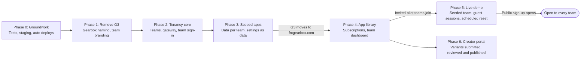
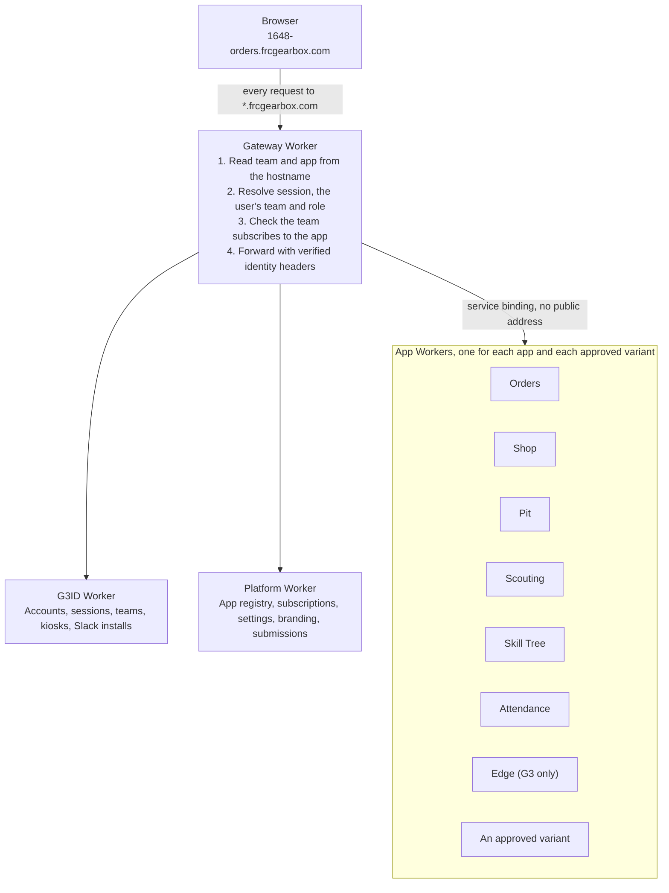

# Multi-Team Platform Roadmap

Status as of 4 October 2026. This file is the plan of record: when a change completes or advances a step, update the step's Status, the Progress table and "What landed" in the same pull request.

## Summary

Gearbox becomes one hosted platform at frcgearbox.com. Each team gets its own sign-in, branding and choice of apps, at addresses like `1648-orders.frcgearbox.com`, named by the team's FRC number.

The work runs in seven phases. G3 is the first team from the first migration, so `main` stays deployable for G3 at every step and there is no long-lived fork.

Labels on the arrows mark the three release points. Phases 5 and 6 each depend on Phase 4 but not on each other.

| Phase | What exists when it ends | Relative size |
| --- | --- | --- |
| 0. Groundwork | Tests, automated deploys, staging, one shared auth middleware, Attendance on D1 | Medium |
| 1. Remove G3 from the platform | G3 branding comes only from the team's config; internal code names stay | Medium |
| 2. Tenancy core | Teams, a team on every account, the gateway, a branded sign-in per team | Large |
| 3. Team-scoped apps | Every row and file belongs to a team; team settings are out of code | Largest |
| 4. App library and dashboard | Team admins turn apps on and off and edit settings | Medium |
| 5. Live demo | Anyone can try a seeded team with no account | Medium |
| 6. Creators' portal | Teams submit app variants; you review and publish them | Medium |

Sizes compare the phases to each other. They are not a schedule.

Three release points sit between phases: G3 moves to its frcgearbox.com addresses after Phase 3, invited pilot teams join after Phase 4, and public sign-up opens after Phase 5.

## Progress

As of 4 October 2026, five of the six Phase 0 steps are done on `main`, the new site config has delivered part of Phase 1 early, and Phase 2 has started: G3ID has teams, and each app is served by its own Worker behind a gateway. Phases 3 to 6 have not started.

| Phase | Status | What is left |
| --- | --- | --- |
| 0. Groundwork | In progress | The deploy workflow with a staging environment (0.2) |
| 1. Remove G3 from the platform | In progress | Three page texts that still say G3 (1.1); theme, logo and font from the team's config (1.3, 1.4); Scouting's G3-specific names (1.6); the README (1.7) |
| 2. Tenancy core | In progress | Operator tools (2.8), local development (2.9), team context per request (2.10) |
| 3. Team-scoped apps | Not started | All of it |
| 4. App library and dashboard | Not started | All of it |
| 5. Live demo | Not started | All of it |
| 6. Creators' portal | Not started | All of it |

### What landed

| Change | Roadmap step | Pull request |
| --- | --- | --- |
| Workers test setup and baseline tests for every worker | 0.1 | [#128](https://github.com/midtownrobotics/Gearbox/pull/128) |
| One auth middleware in `packages/auth` | 0.3 | [#128](https://github.com/midtownrobotics/Gearbox/pull/128) |
| One site config for domain, team and branding, with `pnpm configure` writing the generated values | 0.4, 1.5, most of 1.1, part of 1.4 | [#128](https://github.com/midtownrobotics/Gearbox/pull/128) |
| Attendance on D1, with production history copied and verified | 0.5 | [#133](https://github.com/midtownrobotics/Gearbox/pull/133) |
| MIT license, and draft terms and privacy policy in `docs/legal/` | Part of 0.6 | [#132](https://github.com/midtownrobotics/Gearbox/pull/132) |
| Each app's Worker serves its page and `/api`, behind one gateway on `*.g3robotics.com`; Pages retired | Most of 2.4, the start of 2.3 | [#138](https://github.com/midtownrobotics/Gearbox/pull/138), [#140](https://github.com/midtownrobotics/Gearbox/pull/140) |
| `apps/admin` and `workers/api` stubs removed | Rest of 0.6 | [#142](https://github.com/midtownrobotics/Gearbox/pull/142) |
| Teams in G3ID: a team on every account, kiosk, PIN and Slack code, and PINs unique within a team | 2.1, 2.2 | [#142](https://github.com/midtownrobotics/Gearbox/pull/142) |
| Team-aware gateway: team-number addresses, sessions and Origins kept to their team, identity headers; pages call other apps' APIs at a relative `/api/~<app>` | 2.3, most of 2.4 | [#142](https://github.com/midtownrobotics/Gearbox/pull/142) |
| Sign-in per team on `<number>-id`, with provider callbacks on `id.<domain>` and the team in the sign-in's state | 2.5 | [#142](https://github.com/midtownrobotics/Gearbox/pull/142) |
| Slack per team: workspaces connected from G3ID's admin page, tokens encrypted, commands and events routed by workspace | 2.6 | [#142](https://github.com/midtownrobotics/Gearbox/pull/142) |
| Team sign-up on the platform Worker: details, Slack, and the founder's code; the team registry; other teams' addresses on frcgearbox.com | 2.7 | [#142](https://github.com/midtownrobotics/Gearbox/pull/142) |
| A version per app, changelogs, and a `main` to `public` release flow | Part of 0.2 | [#128](https://github.com/midtownrobotics/Gearbox/pull/128), [#129](https://github.com/midtownrobotics/Gearbox/pull/129) |
| Shared navbar, light and dark mode, one color scheme | Groundwork for 1.3 | [#126](https://github.com/midtownrobotics/Gearbox/pull/126), [#127](https://github.com/midtownrobotics/Gearbox/pull/127) |

### What this changed in the plan

- **Internal names stay.** The team decided that `@g3/*` packages, the `G3ID` binding, and cookie and database names are not branding, and none of them are renamed in this roadmap. Step 1.1 covers only what users see, and the cookie rename (1.2) is dropped: in step 2.5 the `g3_session` cookie keeps its name and only moves to the frcgearbox.com domain.
- **One team per account.** A user belongs to exactly one team, held as `team_id` on the user row. There is no memberships table, and `is_admin`, `is_mentor` and `status` stay on the user as they are today (steps 2.1, 2.2).
- **The site config is the bridge to team records.** It is compiled into each app today, so one build serves one team. Step 2.10 replaces it with team context resolved on each request.
- **Releases shape deploys.** `main` deploys to staging and `public` to production (0.2). An approved variant goes live with the next release (Phase 6).
- **Changesets apply to everyone.** A variant's pull request needs one, like any other change to an app (6.4).

## Where the codebase started

This is the baseline from 3 October 2026, before any roadmap work. The Progress section shows what has changed since. Every layer assumed one team: one domain, one Slack workspace, one user list, and about 90 tables with no team column.

| Area | What is single-team today | Where |
| --- | --- | --- |
| Domain | `g3robotics.com` is hardcoded in 67 files (143 lines): CORS allowlists, the redirect check, the cookie domain, `.env.production`, Wrangler routes | every worker's `src/index.ts`; `workers/g3id/src/lib/redirect.ts` and `cookie.ts` |
| Users and roles | One global user list. `is_admin` and `is_mentor` are columns on the user. Emails are unique globally. PINs are 3 digits and unique globally, so 1,000 at most | `workers/g3id/src/db/schema.ts` |
| Sessions | Cookie `g3_session` on the parent domain. KV maps a session to a user ID and nothing else | `packages/auth`, `workers/g3id/src/lib/session.ts` |
| Auth in app workers | Seven workers each carry their own copy of the "ask G3ID who this is" middleware | `workers/*/src/middleware/auth.ts` |
| Slack | One workspace ID and one bot token in env. Sign-up is Slack-only | `workers/g3id/wrangler.toml`, `lib/slack-code.ts` |
| Data | Seven D1 databases, one per worker. Attendance keeps its data in a Firebase project (`g3-attendance`) instead | migrations; `workers/attendance/src/firestore.ts` |
| Hardware | One edge box: singleton rows (`CHECK (id = 1)`), one agent URL, one shared key | `workers/edge` |
| Deploys | Workers by hand with `wrangler deploy`. Frontends through Cloudflare Pages, one project per app. CI only lints, type-checks and tests | `.github/workflows/ci.yml` |
| Tests | Only `devices/edge-agent` has tests (10 files). No worker has any |  |

### Team settings that live in code or config

These are the items to pull out into per-team data.

| App | Setting | Where it lives now |
| --- | --- | --- |
| Pit | Team number, event key | `TEAM_NUMBER` and `EVENT_KEY` vars in `wrangler.toml` |
| Scouting | "Our team" is `frc1648` in match logic; `relationTo1648` in the API; "BoyleBucks" game name; strategy admins by email | `workers/scouting/src/index.ts`, `apps/scouting/src` |
| Portal | The app list, public site, Slack, TBA, Statbotics, GitHub and Instagram links | `apps/portal/src/plugins/home/home-page.tsx` |
| Skill Tree | All tree content, 60 KB of it | `apps/skill-tree/data/trees.js` |
| Shop | Two Slack channel IDs seeded by migrations; Onshape company ID and API keys in env; R2 bucket `g3-bucket` | migrations `0008`, `0015`; `wrangler.toml` |
| Orders | Fiscal year start (July) in code; Share-A-Cart account; Slack bot token | `src/lib/fiscal.ts`, env |
| Edge | 50 GB cap seeded by migration; agent URL and key in env | migration `0001`, `wrangler.toml` |
| All | Logo `g3.png`, burgundy palette, Agency FB font, "G3" in every title and nav bar | `packages/ui/src`, each app's `index.html` and `nav-bar.tsx` |

### What is already in good shape

- Most of what you named as team data is already rows that mentors edit in the UI: Orders budget categories, yearly budgets, vendors, naming template and keyword rules; Shop processes and subsystems; Pit checklists; Scouting forms. These need a team column, not a redesign.
- Six of nine apps share the plugin layout, every worker is Hono, and six of the eight use Drizzle on D1. One pattern covers most of them.
- Workers already reach G3ID through a service binding, so there is one place to add team context.

### What will cost the most

- Scouting is one 3,255-line worker file and a 2,118-line `App.tsx`, with 31 tables.
- Skill Tree is plain JavaScript written against a Firebase-shaped shim.

## Target architecture

One gateway Worker answers every `*.frcgearbox.com` request. It reads the team and app from the hostname, checks the session and the team's subscription, and hands the request to that app's Worker.

App Workers have no public address, so the gateway is the only way in. It asks the G3ID and Platform Workers who the user is and what the team has switched on.

### Addresses

| Address | What it serves |
| --- | --- |
| `frcgearbox.com` | Public site, team sign-up, "Try the demo" |
| `<number>.frcgearbox.com` | Team home (app launcher) and the team admin dashboard |
| `<number>-id.frcgearbox.com` | The team's sign-in page (G3ID) |
| `<number>-<app>.frcgearbox.com` | One app for one team. Pages and `/api` share the origin, so CORS is no longer needed |
| `id.frcgearbox.com` | OAuth callbacks (and Slack endpoints, 2.6). One fixed host, because providers need a registered callback address; the team travels in the sign-in's state |
| `creators.frcgearbox.com` | Creators' portal |
| `admin.frcgearbox.com` | Your team's console: review queue, teams, app library |

A team's address is its FRC team number, and no two teams can share a number. The first hyphen always separates team from app: `1648-skill-tree` is team 1648, app `skill-tree`. A hostname that starts with a digit is a team; platform addresses (`www`, `id`, `creators`, `admin`, `demo`) are words, so teams need no slugs and no reserved list. In G3ID a team's id is its key, `frc<number>`.

### Identity

- **Each account belongs to one team.** The user row carries `team_id`, and roles stay where they are: `is_admin`, `is_mentor` and `status` (pending, active, rejected) on the user. A team's owner is recorded when team sign-up (2.7) is built. There is no memberships table. Emails and linked sign-ins stay unique across the platform, so someone who helps two teams needs a second account with a different email and sign-in.
- **Each team owns its sign-in environment:** which sign-in methods are allowed, how people join (invite link, its Slack workspace, admin approval), its Slack connection, its kiosks and PINs.
- **Platform operators are separate.** A flag for your team that no team role implies.
- **App code never sees the session cookie.** The gateway reads it, removes it, and passes verified identity (user, team, role, session type) to the app Worker over a service binding. App Workers have no public address of their own.
- **Kiosk PIN sessions belong to one team** and are refused on any other team's hosts.

### Data

- **One shared database per app, with a `team_id` on every team-owned row.** This keeps D1 and the current migrations. Queries go through a shared helper that cannot run without a team.
- **Three kinds of table,** decided per app: team data (has `team_id`), shared reference data that every team reads (TBA caches, the part-lookup cache, the base parts catalog), and platform data (teams, apps, subscriptions, submissions).
- **Files, keys and jobs carry the team:** R2 objects under `teams/<team_id>/`, KV keys prefixed, queue messages tagged, cron jobs looping over teams.
- **Per-team secrets** (Slack bot token, Onshape keys, Share-A-Cart tokens) are stored encrypted in the platform database, with the key held as a Worker secret.

### App library

- **An app is one Worker plus a manifest.** The Worker serves the built frontend and the API. The manifest declares slug, name, icon, roles, integrations it needs, a settings schema with defaults, and hooks to seed, export and delete a team's data.
- **Four levels of customization.** Settings need no code. Optional plugins inside an app are switched on per team. A variant is a separate library entry with its own slug, built by a team and approved by you. A single-team app is a variant that only its author team can run. It is still listed publicly, so other teams can read it and build their own from it.

## Hosting and stack decisions

Seven choices were confirmed on 3 October 2026. Everything else stays on the current stack.

| Decision | Confirmed choice | What it replaces |
| --- | --- | --- |
| Domain and addresses | `frcgearbox.com`, one level deep: `<number>-<app>.frcgearbox.com` | `<app>.g3robotics.com` and `api.<app>.g3robotics.com` |
| Certificates | The free certificate for `*.frcgearbox.com`, one wildcard DNS record, one wildcard route | A Custom Domain and its own certificate per hostname |
| Frontends | Each app's Worker serves its own built frontend (Workers static assets) behind the gateway | Nine Cloudflare Pages projects |
| Attendance storage | D1 | The Firebase project `g3-attendance` |
| Deploys | GitHub Actions: main deploys to staging and public to production | `wrangler deploy` by hand and Pages Git builds |
| Variant apps | Reviewed pull requests merged into this repo | New |
| Staging address | frcgearbox.com hostnames until G3's cutover, then g3robotics.com hostnames in the same team-app pattern. Production and staging trade domains, so they never share one | New |

**Why one level.** Cloudflare's free certificate covers the domain and one level of subdomain ([Universal SSL limitations](https://developers.cloudflare.com/ssl/edge-certificates/universal-ssl/limitations/)). Today's two-level names work because each is a Custom Domain with its own certificate, but Custom Domains take no wildcards and stop at 100 per zone ([Custom Domains](https://developers.cloudflare.com/workers/configuration/routing/custom-domains/), [Workers limits](https://developers.cloudflare.com/workers/platform/limits/)). A wildcard route matches any hostname ([Routes](https://developers.cloudflare.com/workers/configuration/routing/routes/)), and a wildcard DNS record can be proxied on every plan ([Wildcard DNS records](https://developers.cloudflare.com/dns/manage-dns-records/reference/wildcard-dns-records/)).

**Unchanged.** Cloudflare Workers, D1, KV, R2, Queues, Workers AI and cron triggers; Hono, Drizzle, React, Vite and Tailwind v4; pnpm, Biome and GitHub.

**Not in this roadmap.** Each of these would need a separate yes from you: Advanced Certificate Manager, a custom domain per team, Workers for Platforms, a payment provider, an email-sending service, and Durable Objects.

### Plan limits that affect the work

| Limit | Workers Free | Workers Paid |
| --- | --- | --- |
| D1 databases per account | 10 | 50,000 |
| Size of one D1 database | 500 MB | 10 GB |
| Workers per account | 100 | 500 |
| Static files per Worker | 20,000 | 100,000 |

The account is on Workers Paid with the Standard usage model, so the right-hand column applies. Seven production databases and a staging copy of each fit well inside it. Sources: [D1 limits](https://developers.cloudflare.com/d1/platform/limits/), [Workers limits](https://developers.cloudflare.com/workers/platform/limits/).

## Phase 0: Groundwork

Phase 0 changes nothing a user can see. It makes the later phases safe to ship, with tests for every worker and deploys that nobody runs by hand.

| Step | Change | Where | Status |
| --- | --- | --- | --- |
| 0.1 | Add a Workers test setup and baseline tests for sign-in, sessions, roles, kiosk PINs and each worker's main routes | every `workers/*`, `packages/testing`, `.github/workflows/ci.yml` | Done |
| 0.2 | Deploy from GitHub Actions and add a staging environment to every worker: `main` deploys to staging and `public` to production, with migrations before workers. Staging runs on frcgearbox.com hostnames until G3's cutover. The release flow that feeds it is in place: a version per app, changelogs, and the `main` to `public` release | each `wrangler.toml`, `.github/workflows/release.yml`, new deploy workflow | In progress |
| 0.3 | Replace the seven copies of the auth middleware with one in `packages/auth` | `packages/auth/src/g3id.ts` | Done |
| 0.4 | Put the domain in one config module and remove the hardcoded references. Drop `*.pages.dev` from the CORS allowlists | `packages/site-config/src/site.ts`, `scripts/configure.ts` | Done |
| 0.5 | Move Attendance from Firestore to D1 and import G3's attendance history | `workers/attendance` | Done |
| 0.6 | Remove the `apps/admin` and `workers/api` stubs and the stale files in `docs/`, add the MIT license at the repo root, and make `CLAUDE.md` the architecture reference | `apps/admin`, `workers/api`, `docs/` | Done |

**What is left.** The deploy workflow with a staging environment (0.2).

**Done when:** a merge to `main` reaches staging with nobody running Wrangler, and CI fails when a sign-in or role test breaks.

Steps 0.3 and 0.4 matter most for what follows. After them, team context is added in one middleware and one config module instead of in dozens of files.

## Phase 1: Remove G3 from the platform

After Phase 1 the platform is named Gearbox and "G3" appears only in G3's own brand record. G3's members see no difference.

| Step | Change | Where | Status |
| --- | --- | --- | --- |
| 1.1 | Every name a user sees comes from the team's config: team name, short name, number, app titles and the sign-in app's name. Three page texts still say G3: the G3ID sign-up page, Orders settings and Shop admin. Internal names stay as they are: `@g3/*` packages, the `G3ID` binding, and cookie and database names | `packages/site-config/src/site.ts` and its helpers | In progress |
| 1.2 | Rename the session cookie. Dropped: `g3_session` is an internal name and keeps it. Only its domain changes, in step 2.5 |  | Dropped |
| 1.3 | Theme from data: keep the `primary-*` and `secondary-*` class names, but set their CSS variables when the page loads from the team's brand. The shared `--g3-*` color variables added for dark mode are the place to do it. The platform default becomes a neutral Gearbox palette | `packages/ui/src/index.css`, `packages/ui/src/colors.css` | Not started |
| 1.4 | Hold the team's brand in one config file until Phase 2 gives it a table. Name, short name, number, links and the Slack bot's name are there. Still to move: the logo `g3.png`, the burgundy palette and the Agency FB font | `packages/site-config/src/site.ts`, `packages/ui`, `apps/portal`, `apps/scouting` | In progress |
| 1.5 | Titles, nav bars and meta descriptions read the team name | `siteConfig()` in each app's `vite.config`, `AppNavBar` in `packages/ui` | Done |
| 1.6 | Rename G3-specific names in features: `relationTo1648` to `relationToTeam`, the `g3-match` class, and "BoyleBucks" becomes a label the team sets | `apps/scouting`, `workers/scouting` | Not started |
| 1.7 | Rewrite `README.md` for the platform. `CLAUDE.md` now points every session at this roadmap | repo root | In progress |

**Leave alone for now.** Names on the edge box (`g3-edge-agent`, `/var/lib/g3-edge`, the nftables table `inet g3`) stay as they are, because Edge is G3's own app and not part of base Gearbox. Cloudflare resource names such as `g3-orders-prod` and `g3-bucket` are never shown to users and can stay.

**Done when:** nothing a user sees says G3, g3robotics.com or 1648 unless it came from the team's config. Internal names, G3's seed data and G3's Edge app are the exceptions.

## Phase 2: Tenancy core

After Phase 2 a second team can be created on staging, sign in on its own branded page and land on an empty team home. This is where "create their own SSO environments" is built.

| Step | Change | Where | Status |
| --- | --- | --- | --- |
| 2.1 | Teams in G3ID's database: a `teams` table keyed by the team's `frc<number>` key (the key `team_ui_settings` already uses), with its number and name, and a required `team_id` on users, kiosk devices, activation codes, PINs and Slack codes. PINs are unique within a team, and a kiosk signs in only its own team's members. Branding is `team_ui_settings` ([#134](https://github.com/midtownrobotics/Gearbox/pull/134)); sign-in settings, invites and Slack installations get their tables in the steps that use them (2.5, 2.7, 2.6) | `workers/g3id/src/db` | Done |
| 2.2 | Create G3's team (`frc1648`) and set it as the team of every existing user, kiosk, PIN and Slack code. `is_admin`, `is_mentor` and `status` stay as they are | `workers/g3id/src/db/migrations/0013_teams.sql` | Done |
| 2.3 | Gateway Worker on `*.<domain>/*` (frcgearbox.com once `site.ts` moves there): parse the hostname (`<number>-<app>`, `<number>`, and the site team's current addresses), load the team, drop a session whose user belongs to another team, refuse `/api` requests whose Origin is another team's host (reads too, since CORS allows the whole domain), forward over a service binding with identity headers. App Workers have no workers.dev address | `workers/gateway` | Done |
| 2.4 | Each app Worker serves its own built frontend plus `/api`. Frontends call a relative `/api`, and another app's API at `/api/~<app>` on their own address (the gateway routes it, for the same team). The public `api.*` routes and the Pages projects are retired app by app. Code no longer uses the `api.*` hosts; the gateway answers them until Slack, Onshape's webhook and the edge box are moved, then each app's `api` is set to `null` in `site.ts` | every `wrangler.toml`, each app's `vite.config.ts` and API client, `workers/gateway` | In progress |
| 2.5 | Sign-in per team, with G3ID kept as the sign-in app: each team signs in at `<number>-id.frcgearbox.com/login`, which shows the team's number and name. OAuth callbacks land on `id.frcgearbox.com` with the team and return address in the sign-in's state (kept server-side in KV, or signed for GitHub), and only that team's members are signed in, by every method (Google, GitHub, Steam, Slack codes, email, kiosk PIN). The redirect check accepts only pages of the team being signed in to. The page footer carries a small donation link, one address set for the whole platform (`site.donationUrl`). The session cookie keeps its name (`g3_session`) and moves to the frcgearbox.com domain with `site.ts` | `workers/g3id/src/routes/auth/*`, `lib/redirect.ts`, `lib/oauth-state.ts`, `apps/g3id` login page | Done |
| 2.6 | Slack per team: one Slack app, made installable by any workspace; a team admin connects the team's workspace from G3ID (Admin → Slack, calling back on `id.<domain>`). Each team's workspace ID and bot token are stored in `slack_installations`, the token encrypted with the `SECRETS_KEY` secret. Slash commands and events find the team by workspace, a sign-in code only works from its own team's workspace, and the bot replies with that workspace's token. Removing the app from a workspace forgets it. G3 keeps its existing settings (`SLACK_BOT_TOKEN`, `SLACK_TEAM_ID`) until it connects through the admin page. Orders', Shop's and Scouting's own Slack messages stay on G3's token until Phase 3 | `routes/slack.ts`, `lib/slack-code.ts`, `lib/slack-install.ts`, G3ID's Admin → Slack page | Done |
| 2.7 | Team sign-up on `frcgearbox.com`, served by a new platform Worker that keeps the team registry (number, name, country, time zone, status, founder): the founder enters the team number, name, country and time zone and accepts the terms, then adds the Slack bot to the team's workspace, then sends the bot a code from that workspace. That makes them the team's first admin, with Slack as their sign-in, and signs them in on the team's own address. Members join through the team's Slack, so nobody signs up on other providers. Sign-up is refused when another team already holds that number. Other teams' addresses are on frcgearbox.com; G3 keeps g3robotics.com | `workers/platform`, `apps/platform`, `workers/g3id/src/routes/internal.ts` | Done |
| 2.8 | Platform-operator flag, with tools to delete a team, change its team number or transfer its ownership when a number was claimed wrongly. These live in the shell of `admin.frcgearbox.com` | `workers/g3id`, new console app | Not started |
| 2.9 | Local development: the gateway on one port with `<number>-<app>.localhost` hostnames. Update `.dev-ports.json` and the port printer | `scripts/` | Not started |
| 2.10 | Replace the build-time site config with team context resolved on each request. The values in `site.ts` become G3's team and brand rows. `appUrl`, `wordmark` and the other helpers read the team the gateway resolved. `pnpm configure` and the `%SITE_*%` placeholders in `index.html` go away, so one build serves every team | `packages/site-config`, `scripts/configure.ts`, each app's `vite.config` | Not started |

**Keeping G3 running.** Until G3 moves, a request on an old `g3robotics.com` host is treated as team 1648 (`frc1648`). This lets apps move behind the gateway one at a time.

**PINs.** A 3-digit PIN is now unique within a team, not across the platform, and a kiosk token is tied to one team.

**Done when:** two teams exist on staging, a member of one gets a 403 on the other's hosts, and G3's members sign in with their roles unchanged.

## Phase 3: Team-scoped apps

After Phase 3 every app serves any number of teams from one deployment, and nothing team-specific is left in code or config. This is the largest phase and it is done one app at a time.

### The same five steps for each app

1. **Tenancy sheet.** Classify every table as team data, shared reference data or cache.
2. **Migration.** Add `team_id`, fill it with G3's team for existing rows, and rebuild any table whose primary key or unique index must now include the team. Examples: `vendors.key`, `app_settings.key`, `catalog_categories.name`, and every `CHECK (id = 1)` settings row.
3. **Scoped access.** Route every query through the team-scoped helper. Prefix R2 keys, tag queue messages, and make cron jobs loop over teams.
4. **Settings out of code.** Move the app's team values into its settings schema, with G3's current values as G3's rows.
5. **Isolation test.** Seed teams A and B, call every route as A, and fail if any row of B is read or changed.

### Order and specifics

| Order | App | Tables | Settings to pull out | Notes |
| --- | --- | --- | --- | --- |
| 1 | Skill Tree | 3 | Tree content, from `data/trees.js` into rows. Today's trees become the default template | Smallest app, so it proves the pattern. Rewrite the frontend off the Firebase-shaped shim |
| 2 | Pit | 5 | Team number and event key, from `wrangler.toml` | Team number comes from the team profile |
| 3 | Orders | 17 | Fiscal-year start month, time zone and currency (New York time and US dollars are fixed in code today), Share-A-Cart account, Slack token | Budgets, categories, vendors, naming template and keyword rules are already rows. The seeded catalog becomes shared reference data; a team's own parts and prices are team data |
| 4 | Shop | 17 | Slack channel IDs, Onshape credentials | Processes and subsystems are already rows. Drawings in R2 and the BOM queue need the team. Onshape webhooks must map a company to a team |
| 5 | Attendance | 3 | Sign-in code rules | Built on D1 with `team_id` added to the tables created in step 0.5 |
| 6 | Scouting | About 30 | "Our team" number, game currency label; strategy admins become a role | First split the 3,255-line worker into modules and put its 151 raw SQL calls behind query helpers |
| 7 | Portal | 0 | The app list and team links | Becomes the team home, built from subscriptions and brand links |
| 8 | Edge | 11 | None. Its settings stay G3's own | A single-team app run only for G3. It moves behind the gateway and takes identity from the platform SDK. Its tables need no team column |

Core apps must not depend on Edge. Orders part lookup and Shop printing become optional providers: G3's Edge app supplies both for G3, and a team without a provider enters part details by hand and sees no print button.

### Shared pieces built once

- **Platform SDK** (`packages/platform`): reads the gateway's identity headers, exposes the team-scoped database helper, typed team settings, and role checks.
- **Tenancy lint in CI:** rejects a query on a team table that skips the helper, and any raw `prepare` call outside it.
- **Isolation test harness:** one reusable test, built on packages/testing, that every app, and later every variant, must pass.

**Done when:** isolation tests pass for all seven apps and the lint is required in CI. G3 then moves to its frcgearbox.com addresses.

## Phase 4: App library and team dashboard

After Phase 4 a team admin turns apps on and off and edits the team's settings, with no deploy and no help from you.

| Step | Change | Where |
| --- | --- | --- |
| 4.1 | A manifest in each app: slug, name, icon, summary, roles it uses, integrations it needs, settings schema with defaults, optional plugins, who may run it (every team or one named team), its version from package.json, and hooks to seed, export and delete a team's data | each `workers/<app>` |
| 4.2 | Platform database: `apps`, `team_apps` (subscriptions), `team_settings`, `team_integrations` (encrypted secrets), `audit_log`. The registry is filled from the manifests at deploy | new `workers/platform` |
| 4.3 | Subscribing runs the app's seed hook: starter budget categories, default skill trees, starter checklists | each app's manifest hooks |
| 4.4 | Unsubscribing hides the app at once, keeps its data for a grace period, then deletes it. Export is offered first | `workers/platform`, each app's hooks |
| 4.5 | Team dashboard at `<number>.frcgearbox.com/admin`: Apps, Branding, Members and roles, Sign-in methods, Integrations, Kiosks, Settings per app (forms generated from each schema), Audit log | new dashboard app; takes over the admin pages of `apps/g3id` |
| 4.6 | The gateway enforces subscriptions from a cached team snapshot that is refreshed on every change | `workers/gateway` |
| 4.7 | Team home lists the subscribed apps and the team's links | replaces the hardcoded list in `apps/portal` |

**What "subscribe" means here.** Subscribing is free and switches an app on or off for a team. Gearbox takes no payments. The only money link is the donation link on the sign-in page.

**Done when:** on staging, unsubscribing Orders makes the team's Orders address show "not enabled" within a minute, and subscribing again brings the data back.

Invited pilot teams can join at this point.

## Phase 5: Live demo

After Phase 5 a visitor clicks "Try the demo" on frcgearbox.com and lands in a working, seeded team without creating an account or a team.

| Step | Change | Where |
| --- | --- | --- |
| 5.1 | A demo team, marked as the demo: a fictional team with a reserved number that no real team can claim, sample branding, every app that is open to all teams subscribed. Addresses follow the normal pattern under its number, and `demo.frcgearbox.com` leads there | team record and seed data |
| 5.2 | Guest sessions: no sign-up. The visitor picks a role to view as (student, mentor or admin). Guest sessions expire after a few hours and work only on the demo team | `workers/g3id`, `workers/gateway` |
| 5.3 | Seed fixtures for every app, loaded through the same seed hook as a real subscription: orders and budgets, Shop parts mid-production, Pit checklists, a past public event in Scouting, attendance history, skill progress | a `demo/` fixture set in each app |
| 5.4 | Scheduled reset: delete every row and file that carries the demo team's ID, then seed again | cron in `workers/platform` |
| 5.5 | Side-effect guard: one flag makes Slack messages, printing, part lookup, Share-A-Cart, AI schedule scans and Onshape calls return canned results. Uploads are capped and requests are rate-limited per visitor | `packages/platform`, each integration call site |
| 5.6 | Public site: what Gearbox is, a tour of the apps, "Try the demo", "Create your team" | the public site app from 2.7 |

The demo costs little to add because it reuses Phase 3 and 4 work: the demo is an ordinary team, its data is ordinary team data, and resetting it is a delete by team ID.

**Done when:** the demo works in a private browser window with no account, and nothing a guest does survives a reset or leaves the platform.

Public sign-up can open at this point. A later option is a private sandbox team per visitor, built on the same seeding code, so visitors never see each other's edits.

## Phase 6: Creators' portal

After Phase 6 a team can build its own variant of an app, submit it, and see it in the app library once your team approves it.

### How a variant reaches the library

1. A team admin forks the repo and runs the scaffold command to copy an existing app under a new slug.
2. They build the variant against a local fake team and open a pull request.
3. They register the submission in the portal with the pull request link, a description and screenshots.
4. Automated checks run on the pull request, and a preview is deployed to staging against a throwaway team.
5. Your team reviews it in the console and approves, asks for changes or rejects. Changes go back to step 2.
6. On approval the pull request is merged into main. It goes live with the next release, when main is merged into public and the deploy pipeline publishes the Worker and registers its manifest.
7. The variant appears in the library, and team admins subscribe to it like any other app.

### Work

| Step | Change | Where |
| --- | --- | --- |
| 6.1 | Creator kit: the scaffold command, platform SDK documentation, a local fake team, the written app contract, and contributor terms that place submitted code under the repo license | `scripts/`, `docs/` |
| 6.2 | Variant model: a variant is its own library entry with its own slug and Worker, marked "variant of" a base app with its author team. A frontend-only variant reuses the base app's API and data. A full variant owns its own tables. A single-team app is a variant that only its author team can run, so it need not be configurable for others. G3's Edge app is the first | `workers/platform` registry |
| 6.3 | Portal at `creators.frcgearbox.com`: new submission form, status timeline, reviewer notes | new portal app |
| 6.4 | Checks on every submission: lint, types, tests, tenancy lint, the two-team isolation test, manifest validation, a changeset, staging preview | `.github/workflows` |
| 6.5 | Review console for your team: queue, checklist (security, data scope, accessibility, named maintainer), approve, request changes, reject | `admin.frcgearbox.com` |
| 6.6 | Publish with the next release after the merge. Every entry is visible to every team. A single-team app is listed with its author and source, but other teams cannot subscribe to it | deploy workflow, registry |
| 6.7 | Upkeep rules: a named maintainer, the SDK version it targets, and what happens to subscribed teams if a variant is deprecated or removed | `docs/` |

**The app contract.** A variant must ship a manifest, keep all team data behind the team-scoped helper, read identity only from the platform SDK, and contain no hardcoded team values. The checks in 6.4 enforce most of this before a person reviews it.

**Single-team apps.** A team can submit an app that is too specific to its own setup to share through settings. It is reviewed, merged and listed like any variant, and it may contain values specific to its team. Other teams cannot subscribe to it. They can read it and build their own variant from it. Teams discuss these apps elsewhere: an entry may carry one link to an outside thread, and Gearbox hosts no forum. For a single-team app the isolation test becomes a check that only its author team can reach it.

**Done when:** one variant from outside your team has gone from fork to published without anyone touching Cloudflare by hand.

## Edge: G3's single-team app

Edge is no longer a phase. It stays in the repo as a single-team app contributed by G3: listed in the library for anyone to read, and run only for G3.

| Topic | What it means |
| --- | --- |
| Classification | A variant app authored by G3, in the single-team category. It is not part of base Gearbox |
| Hardware | One box, one key and one tunnel, as today. Nothing is built for a second box |
| Naming | On-box names such as `g3-edge-agent` and `inet g3` stay. G3 names are allowed inside G3's own app |
| Move to the platform | In Phase 3 it goes behind the gateway and takes identity from the platform SDK. It needs no team column |
| Library | From Phase 4 its manifest names G3 as the only team that may run it. In Phase 6 it becomes the first entry in the single-team category |
| Core apps | Orders part lookup and Shop printing treat Edge as an optional provider. Without one, a team enters part details by hand and has no print button |
| Other teams | They can read the source and the design brief in `docs/edge.md`, discuss it elsewhere, and submit their own version |
| Privacy | Its site data is G3's data, under G3's own notice to its members. The platform policy only says that a single-team app may collect more, and that its team must say what |

## Moving G3 in as the first team

G3 never migrates in one jump. Its data is tagged in place during Phases 2 and 3, and only its addresses change at the cutover after Phase 3.

### What changes for G3 at the cutover

| Item | What changes |
| --- | --- |
| Web addresses | `orders.g3robotics.com` becomes `1648-orders.frcgearbox.com`, and likewise for each app. The old addresses redirect for at least one season |
| Sessions | Everyone signs in once more, because the cookie moves to a new domain |
| Shop kiosks | A kiosk token is kept in the browser per address, so each kiosk is activated again |
| Installed apps | Pit and Shop are reinstalled on phones and tablets from the new address |
| OAuth sign-in | Google, GitHub, Steam and Onshape callback addresses are registered for `id.frcgearbox.com` |
| Slack | Slash command and event URLs are repointed. The workspace is recorded as G3's Slack installation |
| Onshape webhooks | Registered again for the new host |
| Edge box | The worker address in `agent.env` is updated. The shared key stays as it is, since Edge remains G3's own app |
| Secrets | Slack, Onshape and Share-A-Cart tokens move from Worker secrets into G3's encrypted team integrations |
| Seeded values | The Slack channel IDs, the 50 GB cap, team number 1648 and the event key become G3's settings rows |
| Staging | Moves from frcgearbox.com to g3robotics.com in the same window, keeping the team-app hostname pattern |

### How to run it

- Rehearse on staging with a copy of production data, including every table rebuild.
- Avoid build and competition season, January through April.
- Keep the old hosts and Pages projects deployed until G3 has run a full week on the new addresses. That is the way back if something fails.
- Remove the `g3robotics.com` compatibility path from Phase 2 once the redirects are in place.

### Staging after the cutover

Production and staging trade domains at the cutover, so the two environments never share a domain or a cookie.

- **Before the cutover,** production is on g3robotics.com and staging uses frcgearbox.com. This also rehearses the wildcard route and the gateway on the real domain.
- **After the cutover,** staging uses `<number>-<app>.g3robotics.com`. The free certificate for `*.g3robotics.com` covers it, so nothing is purchased.
- **Exclusions.** The staging route must leave alone G3's public site, the redirects from the old app addresses, and the edge box's tunnel hostname. `edge-agent.g3robotics.com` contains a hyphen, so it would otherwise be read as a staging address.
- **Telling them apart.** Staging gets its own cookie name and a visible banner, so a G3 member who lands there cannot mistake it for the real apps.

## Terms and privacy

Each team owns its members' data, and Gearbox only hosts it for that team. Both documents say so in plain language, and the product must be able to keep every promise they make.

This is a product view, not legal advice. You will have both documents reviewed before applications open, and drafting proceeds now.

### Settled

| Item | Decision |
| --- | --- |
| Operator | Georgia Robotics Alliance, Inc., doing business as Midtown Robotics Boosters, a 501(c)(3) nonprofit. It is the party named in both documents |
| Code license | MIT for the whole repo. Submitted variants are contributed under it |
| Review | Done offline before applications open |
| Donations | A link in the sign-in page footer to the boosters' existing [donation page](https://www.g3robotics.com/checkout/donate?donatePageId=5adbd61a352f53992db2d729) |
| Teams outside the United States | Open to all, on the conditions set out below |

### Who agrees to what

| Party | Role | What they accept |
| --- | --- | --- |
| Midtown Robotics Boosters | Hosts and secures the data, and uses it for nothing else | The promises in the privacy policy |
| Team owner | An adult mentor or coach who creates the team | The terms, on the team's behalf. They confirm they are 18 or over, that the team number is theirs, and that their members have whatever school or parent permission applies |
| Member | A student or mentor invited by the team | A short privacy notice at first sign-in. Members must be 13 or older |

**Why 13.** The US children's privacy rule, COPPA, covers children under 13 and does not apply to teenagers ([FTC COPPA FAQ](https://www.ftc.gov/business-guidance/resources/complying-coppa-frequently-asked-questions)). FRC is a high-school program, so a minimum age of 13 with no accounts below it is the simplest position.

**Why the team owns the data.** FERPA covers records about a student that a school keeps, or that someone keeps on the school's behalf ([US Department of Education](https://studentprivacy.ed.gov/ferpa)). A school-run team may have to treat records such as attendance that way. That is the school's call to make, which works only if the team, not Gearbox, controls the data.

### Teams outside the United States

You can be open to all. Most of what international teams bring is handled in the documents, because the team already owns its data. Four things need more than wording.

| Consideration | Why it arises | Wording that handles it |
| --- | --- | --- |
| European privacy law reaches Gearbox | GDPR applies to a service outside the EU that offers services to people there, paid or free ([Art. 3](https://gdpr-info.eu/art-3-gdpr/)) | A data processing addendum inside the terms, in force for any team whose law requires one |
| A written processing contract is required | An EU team must have a contract with whoever processes data for it, and the law lists what it must say ([Art. 28](https://gdpr-info.eu/art-28-gdpr/)) | The addendum carries those terms: act only on the team's instructions, confidentiality, security, rules for sub-processors, help with members' requests, deletion at the end, information for audits |
| Data leaves the team's country | Everything is stored in the US on Cloudflare. The EU permits that transfer under its [standard contractual clauses](https://commission.europa.eu/law/law-topic/data-protection/international-dimension-data-protection/standard-contractual-clauses-scc_en) | The addendum adopts the standard clauses, and the policy says plainly that data is held in the US |
| Consent ages differ | Where consent is the legal basis, the EU default is 16, and a country may lower it to 13 ([Art. 8](https://gdpr-info.eu/art-8-gdpr/)) | The owner confirms the team holds the consents its own country requires. Gearbox keeps its floor of 13 |
| Breach deadlines | An EU team has 72 hours to tell its regulator, and its processor must tell the team without undue delay ([Art. 33](https://gdpr-info.eu/art-33-gdpr/)) | A promise to notify team owners without undue delay |
| Every other country's rules | Many countries with FRC teams have their own privacy law | The owner confirms the team may lawfully use a US-hosted service and answers for its own country's rules. The English text governs |

**What wording cannot handle:**

- **Sanctions.** US sanctions bar a US organization from serving some countries and listed parties; the Treasury runs both country-wide and selective programs ([OFAC](https://ofac.treasury.gov/sanctions-programs-and-country-information)). The fix is a country field at sign-up with a blocked list, plus a clause that Gearbox is unavailable where US law forbids it.
- **Promises become product duties.** The addendum is only true if the product can do what it says: export or remove one member on request, delete a team's data when it leaves, publish the list of sub-processors, and notify owners of a breach. Each is in the build list below.
- **An EU representative.** A non-EU service covered by GDPR must name a representative in the EU unless its processing is occasional and low-risk ([Art. 27](https://gdpr-info.eu/art-27-gdpr/)). Whether Gearbox fits that exception is a question for your reviewer.
- **Countries that restrict sending data abroad.** Some require filings, approved contracts or local storage first. That duty sits with the team there and your terms cannot waive it. Ask your reviewer whether to list any country as unsupported.

**Already met by design.** The UK's Children's code expects services used by children to default to high privacy, collect the minimum and avoid nudging ([ICO](https://ico.org.uk/for-organisations/uk-gdpr-guidance-and-resources/childrens-information/childrens-code-guidance-and-resources/age-appropriate-design-a-code-of-practice-for-online-services/)). Gearbox has no advertising, profiling or tracking, and Edge, the one feature that monitors behavior, now runs for G3 only.

**Gaps that are not legal.** Orders fixes US dollars and New York time in code, and both become team settings in Phase 3. The interface is English only, and the parts catalog lists US vendors.

### What the privacy policy should promise

| Topic | Suggested promise |
| --- | --- |
| What is collected | Listed per app: account and linked sign-ins, attendance times, orders and budgets, shop and skill records, scouting notes, uploaded files |
| Use | Only to run the apps for that team |
| Advertising and sale | None. No advertising, no selling or sharing of data, no profiles built for any other purpose |
| Who can see it | Members of the same team, by role. Operators only to fix a problem or handle abuse, with each access logged where the team's admins can see it |
| Where it is stored | In the United States, on Cloudflare |
| Other services | Slack, Google, GitHub, Steam and Onshape receive data only when a team or member connects them |
| Single-team apps | An app run by one team may collect more. That team must tell its members what |
| Retention | A stated period for each kind of data, starting from today's 7-day sessions |
| Export and deletion | A team can export or delete everything it holds. A member is removed through their team admin, and their name is blanked on records the team must keep, such as past orders |
| Incidents | Team owners are told without undue delay if their team's data is exposed |
| Changes | Posted with a date. Owners see material changes at their next sign-in |

### What the terms should cover

- **Free and volunteer-run.** Provided as is, with no uptime promise. Donations are voluntary and buy nothing.
- **Team numbers.** One team per number, and a claim must be truthful. Operators may transfer or delete a team claimed under the wrong number.
- **Acceptable use.** No attempt to reach another team's data, no unlawful or abusive content, no misuse of the demo.
- **Ownership.** A team owns its data and can leave with it. Gearbox gets only the right to host it.
- **Succession.** How ownership passes when a mentor leaves, so a team is never locked out of its own data.
- **Variant and single-team apps.** Submitted code is contributed under the MIT license. The operator may decline, change or remove an app.
- **Other services.** Slack, Onshape and the rest are governed by their own terms.
- **Teams outside the United States.** US hosting, the team's duty to follow its own law, the addendum, and no service where US law forbids it.
- **Suspension and closure.** When a team can be suspended, and how much notice and export time teams get if Gearbox ever shuts down.
- **Liability and governing law.** These two need the reviewer most.

### What this adds to the build

| Addition | Lands in |
| --- | --- |
| Acceptance records: the version and time when an owner accepts the terms and when a member sees the privacy notice | Phase 2 |
| Age confirmation: owner 18 or over, member 13 or over | Phase 2 |
| Country at sign-up, checked against a blocked list | Phase 2 |
| Policy pages and the sub-processor list on the public site, kept as dated files in the repo | Phase 2 |
| Operator access log that each team's admins can read | Phases 2 and 4 |
| Member removal that blanks names on kept records | Phase 3 |
| Retention jobs that enforce the stated periods | Phases 3 and 4 |
| Team export and delete, and export for one member on request | Phase 4 |

**When.** Both documents should be live before the first outside team joins after Phase 4. Pilot teams bring other schools' students, so public sign-up is too late.

**Drafts.** First drafts are written: [Terms of Service](https://claude.ai/code/artifact/40ae9dfd-6d10-458f-b8eb-b7c4cc43ed13), which includes the data processing addendum as Annex A, and [Privacy Policy](https://claude.ai/code/artifact/85718d9c-50e6-487c-8cd1-66c7d02e768e). Square brackets in them mark what your reviewer or your team still has to settle. The team's working copies are now in the repo under docs/legal/.

**One more check.** Read the drafts against [FIRST's Youth Protection Program](https://www.firstinspires.org/resource-library/youth-protection-policy), which applies to mentors and everyone else working with teams.

## Risks and open questions

The risk that matters most is one team seeing another team's data. Most of the safeguards in Phases 0 and 3 exist to prevent it.

### Risks

| Risk | Why it matters | What the roadmap does about it |
| --- | --- | --- |
| Data leaks between teams | One query without a team filter exposes another team's rows. Edge site data is per-student browsing history | Team-scoped helper, tenancy lint, an isolation test on every route, and the same checks on every variant |
| All teams are one site to the browser | Every `*.frcgearbox.com` host shares a site, so cookie SameSite rules do not separate teams | The gateway checks Origin on every write and app code never receives the cookie. Listing the domain on the Public Suffix List is a later option |
| Approved variants run as trusted code | Your review is the only boundary | Automated checks before review, identity only through the SDK, code owners on the platform packages |
| Table rebuilds on live data | SQLite cannot change a primary key in place, and several tables need the team added to theirs | Rehearse each rebuild on a staging copy; export before each production run |
| G3 feature work continues meanwhile | Large files such as the Scouting worker will conflict with the refactor | Small phases that each ship to `main`; split Scouting before scoping it |
| Student data | Most members are minors, and other teams will hold their data on your platform | Terms and a privacy policy before the first outside team joins; export and delete per team from Phase 4 |
| Demo abuse | The demo accepts writes from anyone | Side-effect guard, upload caps, rate limits, scheduled reset |
| Plan limits | Staging doubles the database and Worker counts | Settled: the account is on Workers Paid, and its limits leave room |
| Wrong team-number claims | Anyone can claim a number that no team holds yet, including one that is not theirs | Sign-up warns that a falsely registered team may be permanently deleted with its data; anyone can report a number at `frcgearbox.com/report`, leaving an email to follow up (stored for operators, listed in the console from 2.8); operators can delete, renumber or transfer a team; the terms require a truthful claim; every operator action is logged |
| Hosting single-team apps | Your organization runs and maintains code that serves only one other team | The same review bar as any variant; you may decline; every entry names a maintainer |

### Open questions

- [ ] How does the `public` branch reach Cloudflare today? Step 0.2 needs to know what the deploy workflow replaces.
- [ ] Are the retention periods in section 8 of the privacy policy final? The draft's own to-do list still asks to confirm them.
- [ ] Does Gearbox need a representative in the EU? This is a question for your reviewer.
- [ ] Should any country be listed as unsupported, beyond those US sanctions rule out? Also for your reviewer.

### Answered

| Question | Answer |
| --- | --- |
| Cloudflare plan | Workers Paid with the Standard usage model |
| Staging address | g3robotics.com once production has moved to frcgearbox.com, and frcgearbox.com until then |
| Payment | None. Subscribing is free. A small donation link sits in the footer of the sign-in page |
| Who can create a team | Anyone, for a team number that no other team holds. Operators can delete or reassign a team claimed under the wrong number |
| Invitations | Invite links. No email service |
| Variant visibility | Public to every team. Private variants may be considered later and are not on this roadmap |
| Team addresses | The FRC team number (`1648-orders.frcgearbox.com`); teams have no slugs. G3ID keys teams by `frc<number>` |
| Kiosk PINs | Stay at 3 digits, unique within a team |
| Terms and privacy | Suggestions are in the Terms and privacy section, and drafts of both documents are linked there |
| Operator | Georgia Robotics Alliance, Inc., doing business as Midtown Robotics Boosters, a 501(c)(3) nonprofit |
| Teams outside the United States | Open to all where wording can manage it. The conditions are in the Terms and privacy section |
| Code license | MIT for the whole repo |
| Review of the terms | Offline, before applications open. Drafting proceeds now |
| Donation link | The boosters' donation page on g3robotics.com, linked in the Settled table |
| Edge | A single-team app contributed by G3, not a core app. The Edge phase is removed |
| Single-team apps | A public category: listed for every team, run only by the author team. Teams discuss them off the platform |
| Contact address | contact@frcgearbox.com, as written in both drafts |
| Internal names | @g3 packages, the G3ID binding, and cookie and database names stay as they are, with no renames in this roadmap. Decided in the repo and recorded in CLAUDE.md |
| Teams per account | One. `team_id` on the user row, with no memberships table; roles stay as `is_admin` and `is_mentor` |
